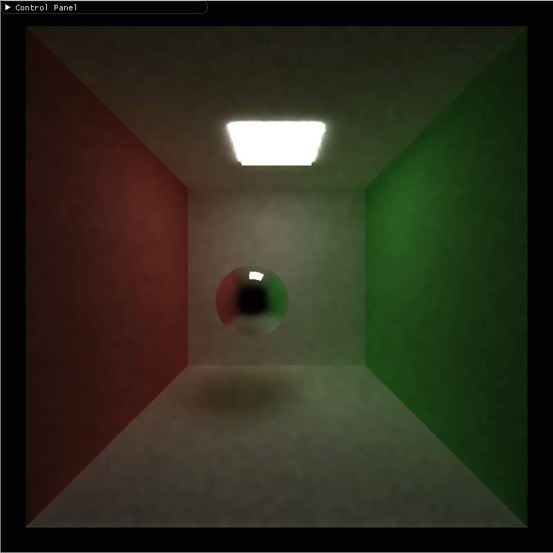
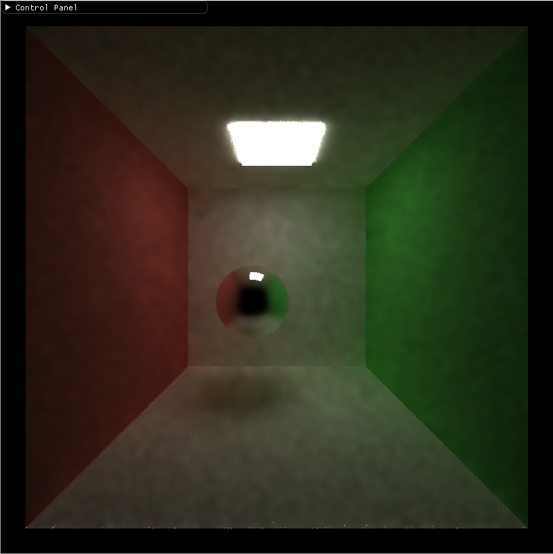
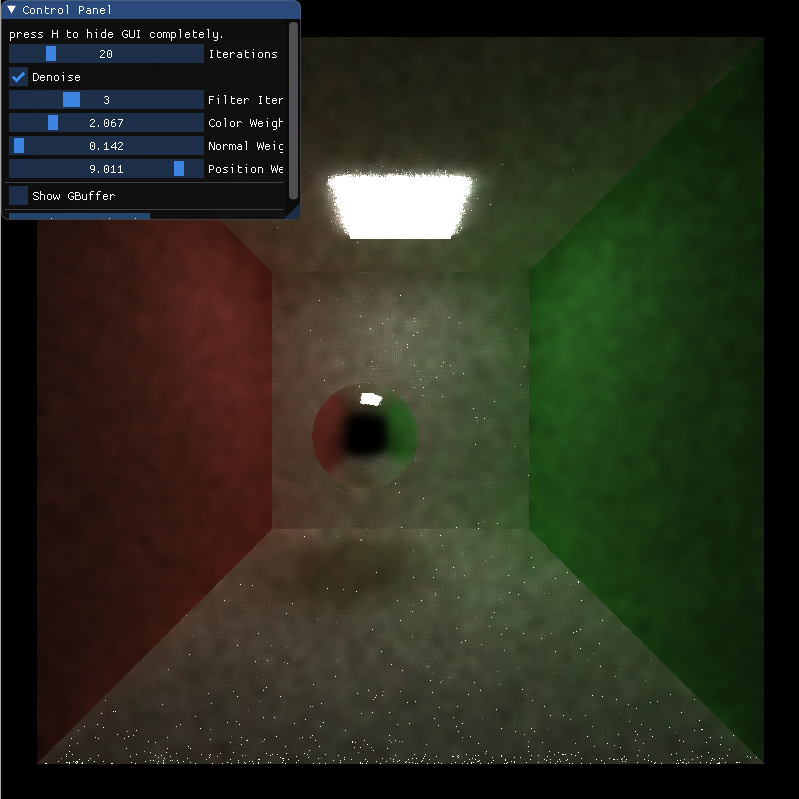
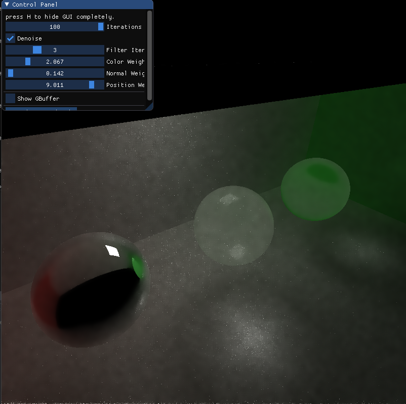
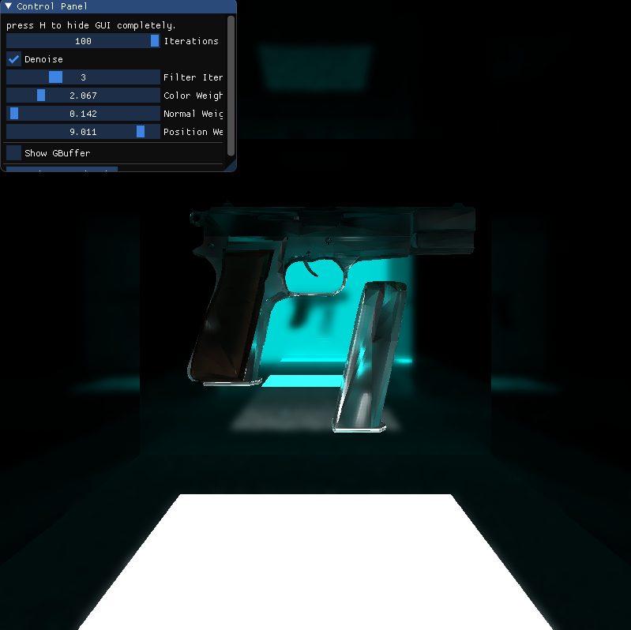
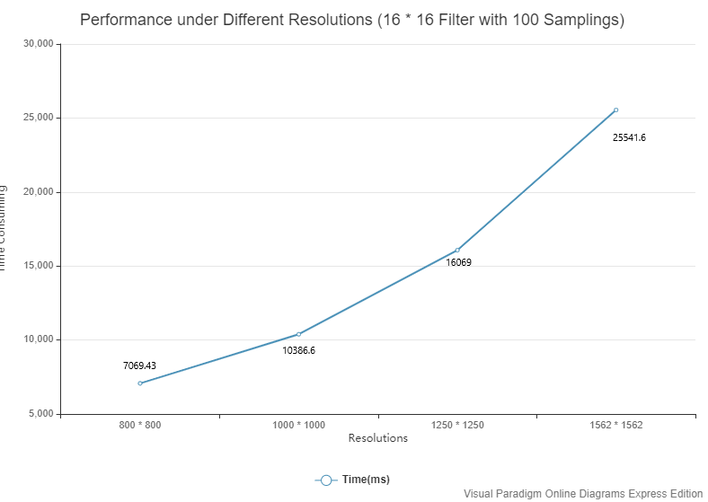
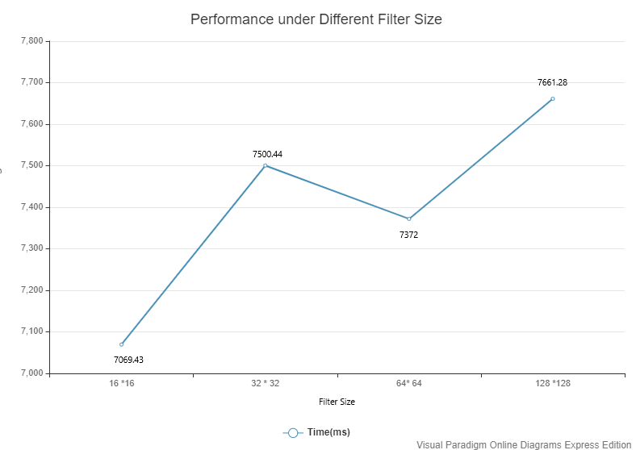
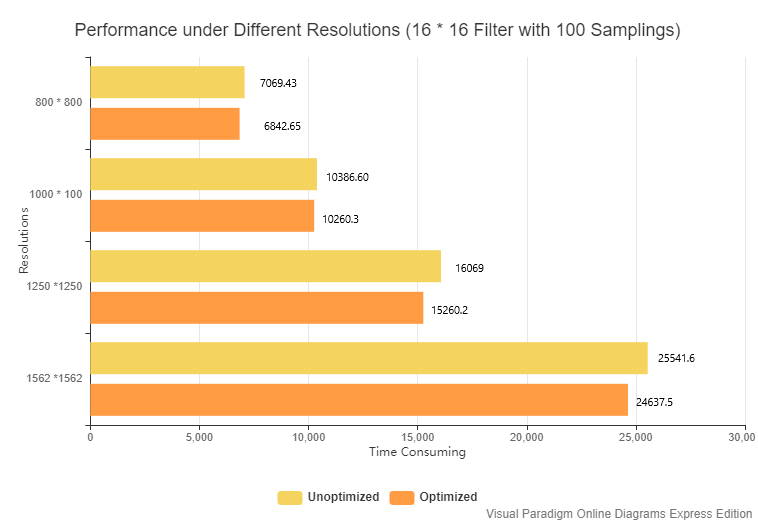
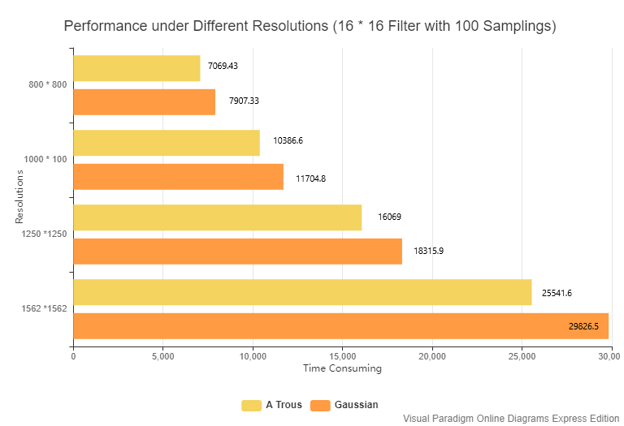

CUDA Denoiser For CUDA Path Tracer
==================================

* **University of Pennsylvania, CIS 565: GPU Programming and Architecture, Project 3**
  * Xuecheng Sun
  * Tested on: Windows 10, R7 3700x @3.7GHz, RTX 2070 super 8GB

### Denoiser Result 

#### Comparison among Different Sample Rate

**100 Samples with an 16 * 16 Filter**

**50 Samples with an 16 * 16 Filter**

****

**20 Samples with an 16 * 16 Filter**

With an 16 * 16 filter, 50 iterations are necessary for a smooth rendering. Fireflies are the main issue for the final render images.

#### Comparison among Different Material Type

For different materials, it seems reflective and refractive details are well preserved. But for fresnel blending material (middle sphere), some details are over smoothed so that the refractive details are not very clear.

For a detail texture, the denoising is a disaster. Almost all details, bump mapping on the surface are oversmoothed. Also, because I use a roughness map, different reflective attributes cause we can see triangles on the mesh very clearly.

#### Benchmarks

**Performance under Different Resolutions**

With the linear growth of resolutions, the time consuming grow near exponentially.

**Different Filter Sizes**

With the grow of filter size, time consuming grows generally. But for kernel size 64 * 64, it cost less time than 32 * 32 which is really weird. It could because of my settings of block size.

**G-Buffer Optimization**

I implemented data compression of G-Buffer, here are some benchmarks of this optimization:

After optimization, there are some slight performance improvements.

**Gaussian Filter vs. A Trous Filter**

A Trous filter run faster than Gaussian filter. The gap is bigger with the growth of resolution.

**Shared Memory Optimization**

I implement shared memory optimization for the first iteration of A Trous.

There are just slight performance improvement, because I only use shared memory for first loop.