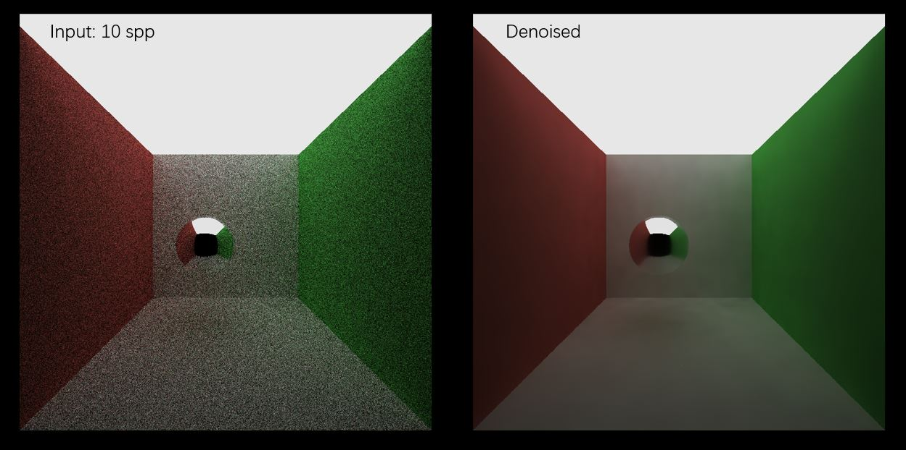
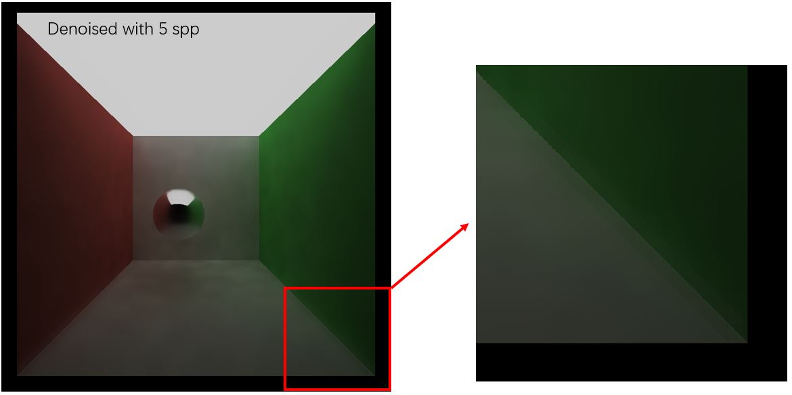
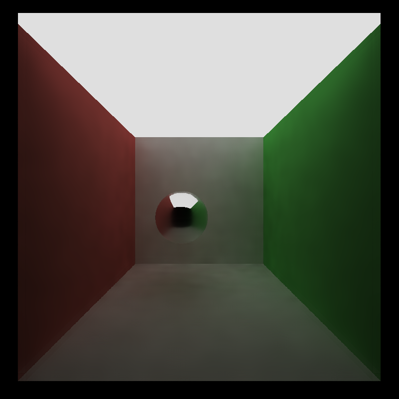
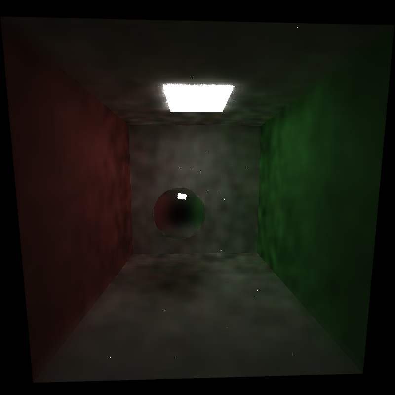
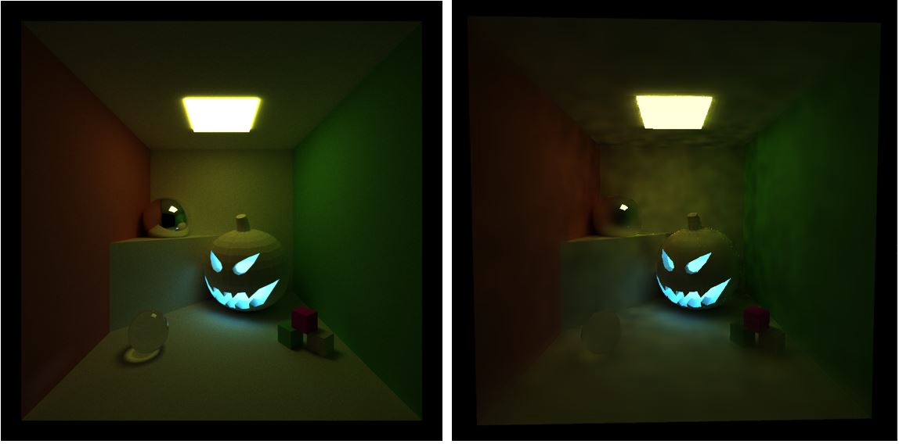

CUDA Pathtracing Denoiser
================

**University of Pennsylvania, CIS 565: GPU Programming and Architecture, Project 4**

* Jilin Liu
  * [LinkedIn](https://www.linkedin.com/in/jilin-liu97/), [twitter](https://twitter.com/Jilin18043110).
* Tested on: Windows 10, i7-8750H @ 2.20GHz, 16GB, GTX 1050Ti 4096MB (personal)

## Features and Results

This is a GPU-based Denoiser for Monte Carlo path-traced images implemented in C++ and CUDA. 
Denoisers can help produce a smoother appearance in a pathtraced image with fewer samples-per-pixel/iterations.

The technique is based on "Edge-Avoiding A-Trous Wavelet Transform for fast Global Illumination Filtering," by Dammertz, Sewtz, Hanika, and Lensch. You can find the paper here: https://jo.dreggn.org/home/2010_atrous.pdf. The raytracing part is based on [this repo](https://github.com/Songsong97/Project3-CUDA-Path-Tracer).

Features:
1. Basic denoiser for Monte-Carlo ray-traced images.
2. Preserve sharp edges for rendered image by using G-Buffer.

## Performance Analysis

### Timing
The denoiser adds a constant overhead to get the final result.

| Scene | ray tracing (one sample iteration) | denoising |
|---|---|---|
| [Cornell Box](./img/non.png) | 18ms | 58ms |
| [Halloween](./img/halloween.png) | 944ms | 58ms |

Since we denoise the image only once, the time is generally much shorter than what the ray-tracing stage takes. This makes sense because the key point for denoiser is to reduce the number of samples for rendering. Further optimization could be made to the denoiser to achieve real-time performance.

### Number of iterations
About 5 to 8 iterations are needed to get an acceptably smooth result. Sometimes it is necessary to increase the number of iterations to get rid of artifacts on edges. For example, when we only sample 5 rays per pixel, there will be visible strange lines in the corner.

This artifact will be smoothed if we sample 7 rays per pixel or more.

### Execution time at different resolutions
The denoiser's execution time is proportional to the image resolution, which is expected as the theoretical complexity is O(pixelCount).

| 800 * 800 | 1600 * 1600 |
|---|---|
| 58ms | 233ms |

### Denoise with different material types
The denoiser is unaware of any material types in the scene. So many different types of material only affect ray tracing part but do not affect denoising part. As mentioned before, the algorithm is only bounded by the pixel number.

### Limitation
When denoising Cornell Box with smaller area light, it works much worse than brighter scenes. The authors of the paper used HDR for their environment, so it might be easier for them to preserve the color of the scene. When the scene is under sampled, the denoiser typically gives us a result that looks dark and stained.

It is also tricky to tune parameters for the Gaussian kernel.

The author mentioned in the paper that, for highly complex scenes, the algorithm is problematic since low number of samples no longer suffice to capture the necessary information.
