CUDA Denoiser For CUDA Path Tracer
==================================

**University of Pennsylvania, CIS 565: GPU Programming and Architecture, Project 4**

* Qiaosen Chen
  * [LinkedIn](https://www.linkedin.com/in/qiaosen-chen-725699141/), etc.
* Tested on: Windows 10, i5-9400 @ 2.90GHz 16GB, GeForce RTX 2060 6GB (personal computer).

## Features

- A Trous Denoiser
- Gaussian Filter (extra credit)

## Denoised Results

- [Cornell Scene](https://github.com/giaosame/Project4-CUDA-Denoiser/blob/base-code/scenes/cornell.txt)

  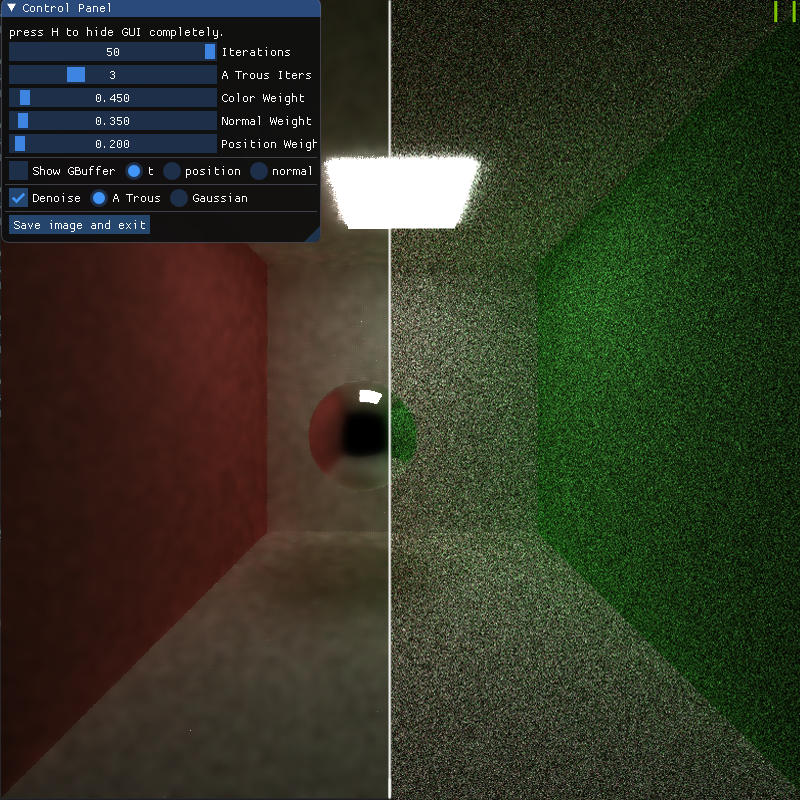

- [Cornell_sdf Scene](https://github.com/giaosame/Project4-CUDA-Denoiser/blob/base-code/scenes/cornell_sdf.txt)

  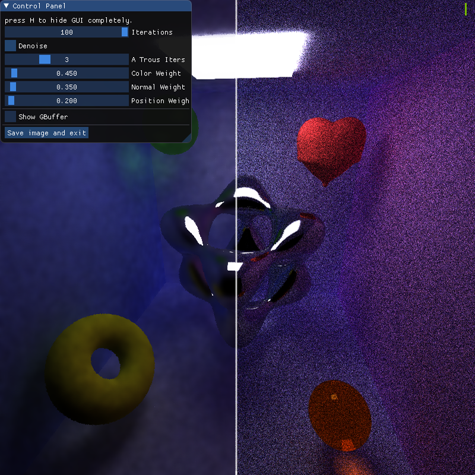

## Performance Analysis

### The extra time denoising adds to the renders

| [cornell](https://github.com/giaosame/Project4-CUDA-Denoiser/blob/base-code/scenes/cornell.txt) | [cornell_ceiling_light](https://github.com/giaosame/Project4-CUDA-Denoiser/blob/base-code/scenes/cornell_ceiling_light.txt) | [cornell_glassball](https://github.com/giaosame/Project4-CUDA-Denoiser/blob/base-code/scenes/cornell_glassball.txt) | [cornell_mjolnir](https://github.com/giaosame/Project4-CUDA-Denoiser/blob/base-code/scenes/cornell_mjolnir.txt) |
| ------------------------------------------------------------ | ------------------------------------------------------------ | ------------------------------------------------------------ | ------------------------------------------------------------ |
|               | 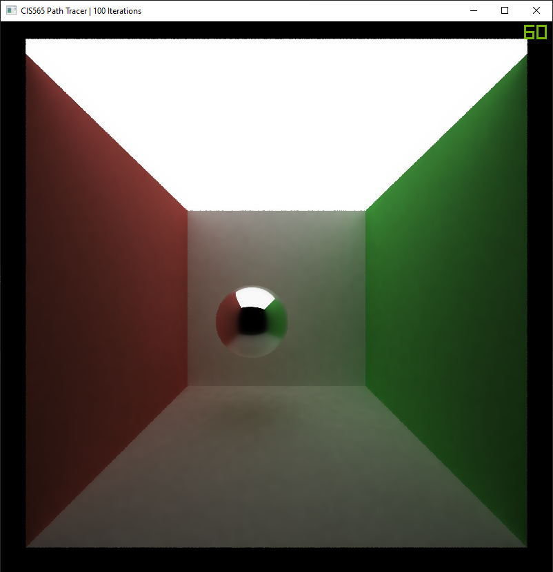 |  | 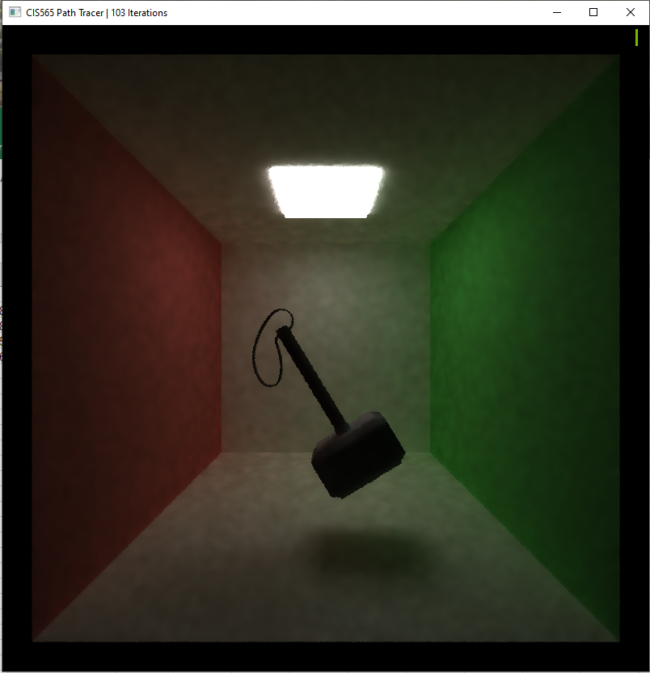 |

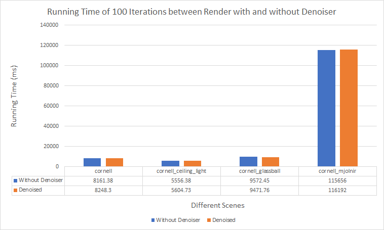

As we can see from the above table, the render with denoiser actually takes a little bit more time to run 100 iterations than the render without denoiser. It's reasonable to spend more time to run extra 3 iteration to compute the A Trous filtering, but the difference in running time is very small, so the Edge-Avoiding A-Trous Wavelet Transform algorithm is very efficient.

### The influences of denoiser on the number of iterations

| [cornell](https://github.com/giaosame/Project4-CUDA-Denoiser/blob/base-code/scenes/cornell.txt) with Denoiser Using 100 Iters | [cornell](https://github.com/giaosame/Project4-CUDA-Denoiser/blob/base-code/scenes/cornell.txt) with Denoiser Using 300 Iters | [cornell](https://github.com/giaosame/Project4-CUDA-Denoiser/blob/base-code/scenes/cornell.txt) without Denoiser Using 1000 Iters |
| ------------------------------------------------------------ | ------------------------------------------------------------ | ------------------------------------------------------------ |
|  |  | 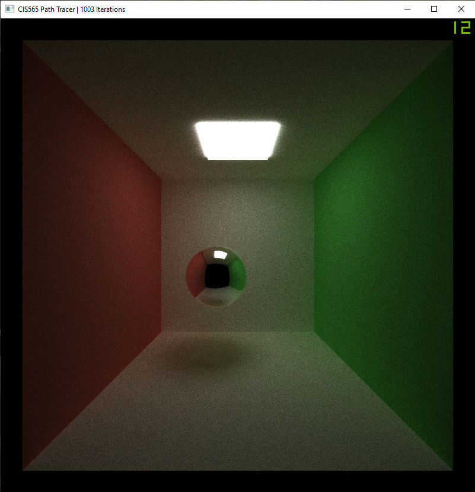 |
| [cornell_glassball](https://github.com/giaosame/Project4-CUDA-Denoiser/blob/base-code/scenes/cornell_glassball.txt) with Denoiser Using 100 Iters | [cornell_glassball](https://github.com/giaosame/Project4-CUDA-Denoiser/blob/base-code/scenes/cornell_glassball.txt) with Denoiser Using 300 Iters | [cornell_glassball](https://github.com/giaosame/Project4-CUDA-Denoiser/blob/base-code/scenes/cornell_glassball.txt) without Denoiser Using 1000 Iters |
|  | 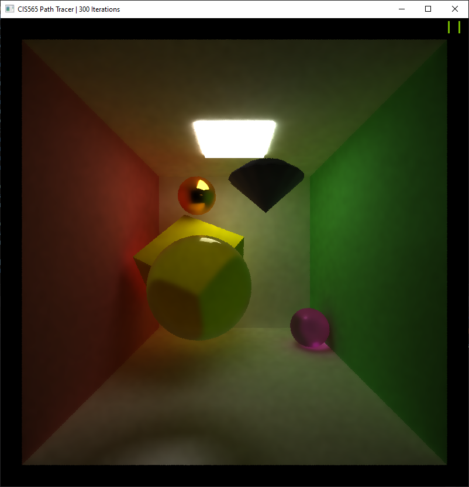 |  |

As the [project Introduction](https://github.com/giaosame/Project4-CUDA-Denoiser/blob/base-code/INSTRUCTION.md) pointing out,  "acceptably smooth" is subjective. So I choose the images without being denoised as the evaluation standard, although there still exists some noise in those image after 1000 iteration. There are still a lot of blurred area can be seen in the denoised images after 100 iterations. Comparing with the above 2 groups of images, I think the denoised images output by the render after 300 iterations have the best performance and they show the "acceptably smooth" results. Thus, in my point of view, the render with denoiser can take less 70% of iterations than the original render to get smooth output.

### The influences of denoiser on the runtime at different resolutions

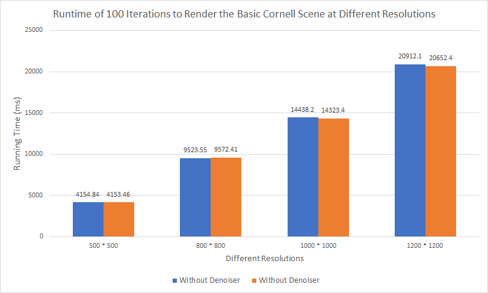

Apparently, larger resolution means more running time. From the above char, we know that denoiser almost doesn't have any influences on the runtime at different resolutions.

###  Effectiveness of denoiser on the different materials

| [cornell_diff_mats](https://github.com/giaosame/Project4-CUDA-Denoiser/blob/base-code/scenes/cornell_diff_mats.txt) with Denoiser Using 100 Iters | [cornell_diff_mats](https://github.com/giaosame/Project4-CUDA-Denoiser/blob/base-code/scenes/cornell_diff_mats.txt) with Denoiser Using 300 Iters | [cornell_diff_mats](https://github.com/giaosame/Project4-CUDA-Denoiser/blob/base-code/scenes/cornell_diff_mats.txt) without Denoiser Using 1000 Iters |
| ------------------------------------------------------------ | ------------------------------------------------------------ | ------------------------------------------------------------ |
| 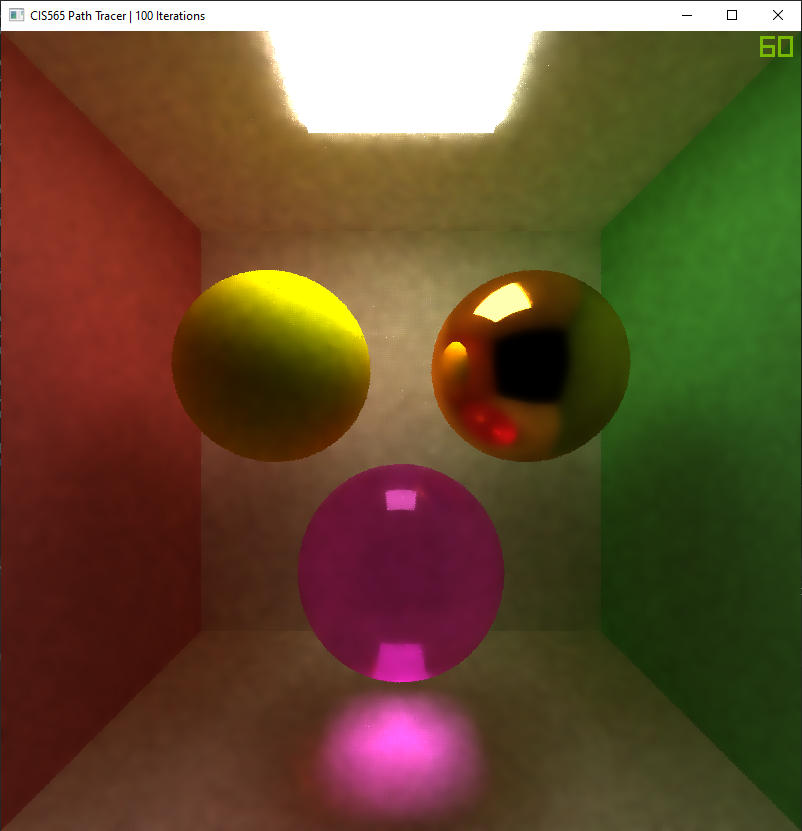 | 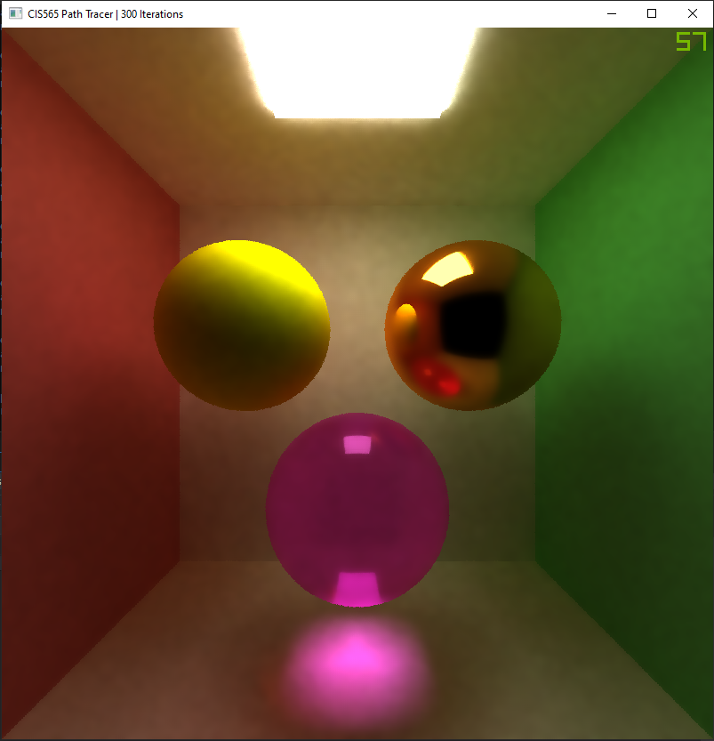 |  |

The denoiser has a great performance on those materials showing a smooth surface, such as specular material and glass material, even the rendered images after running the program 100 iterations shows the "acceptably smooth" surfaces. However, the denoiser doesn't do a good job on the soft shadows on the diffuse material, if the number of iterations is not large enough. Because the filter will blur the surrounding pixels, the soft-shadow effect will also be blurred so that a gradual stratification of shadow cannot be seen very clearly, at this situation, running the denoiser with more iterations, such as 300 iterations, can improve the soft-shadow effect greatly.

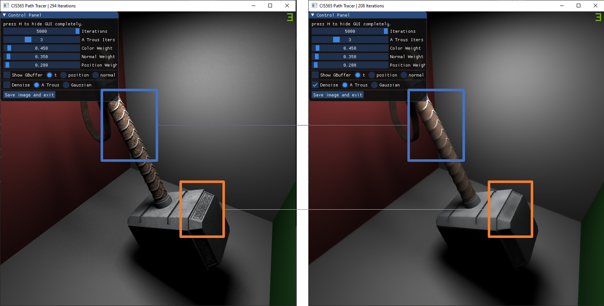

However, the smoothing effect brought by denoiser is absolutely a disaster for materials with texture mapping. The details of textures will be blurred so that no interesting texture details can be seen from the denoised images.

### Visual results and performance for varying filter sizes

| 1 x 1                                                        | 5 x 5                                                        | 17 x 17                                                      |
| ------------------------------------------------------------ | ------------------------------------------------------------ | ------------------------------------------------------------ |
|  |  |  |
| **33 x 33**                                                  | **65 x 65**                                                  | **129 x 129**                                                |
|  |  | 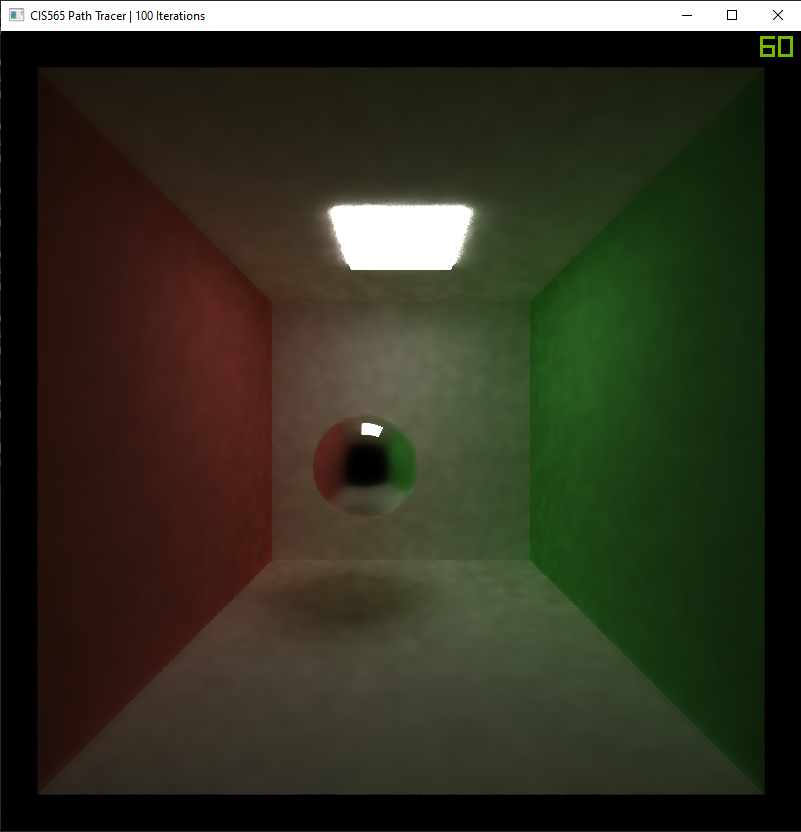 |

If the filter size is small, for example less than 17 x 17, i.e., use fewer than 3 iterations to call the edge stopping function, the denoising is not effective, the images are still filled with grains, because of the small blurred area. Comparing the usual filter size 17 x 17, those images denoised with larger filter size don't show a great improvement, and from the following chart we can know that the difference in filter size don't have a impact on running time, so it's feasible and reasonable to choose 17 x 17 as the A Trous filter size.

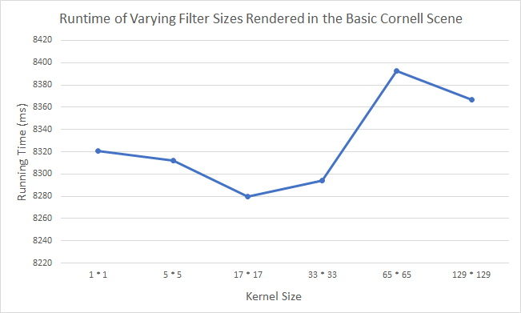

### A-Trous filtering and Gaussian filtering Comparison

| A-Trous Filtering Result                                     | Gaussian Filtering Result                                    |
| ------------------------------------------------------------ | ------------------------------------------------------------ |
|  | 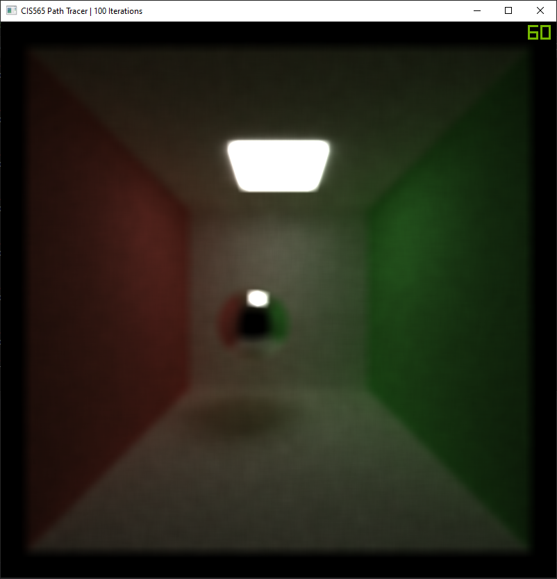 |
|  | 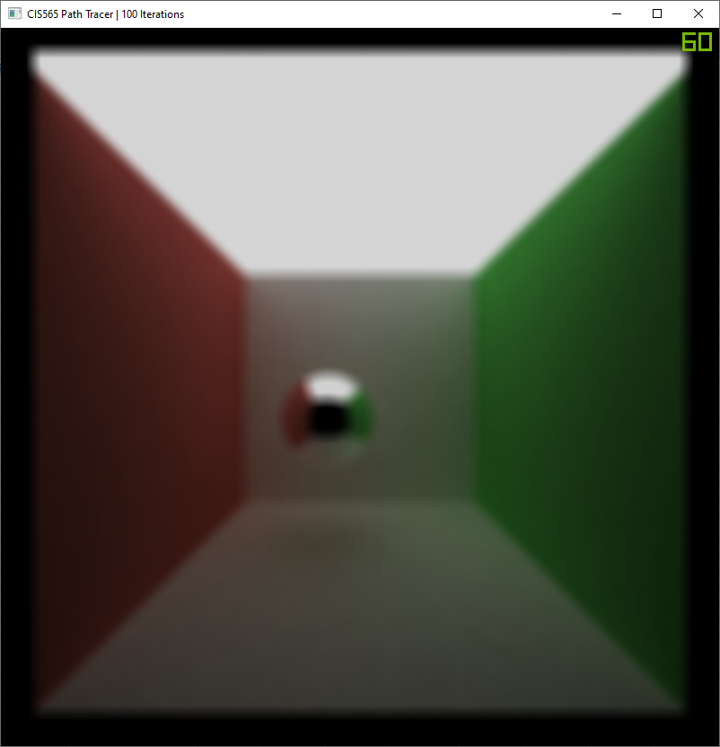 |
|  | 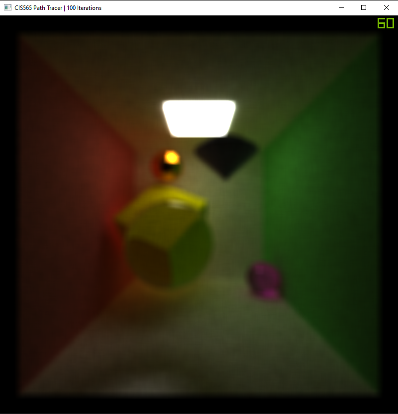 |

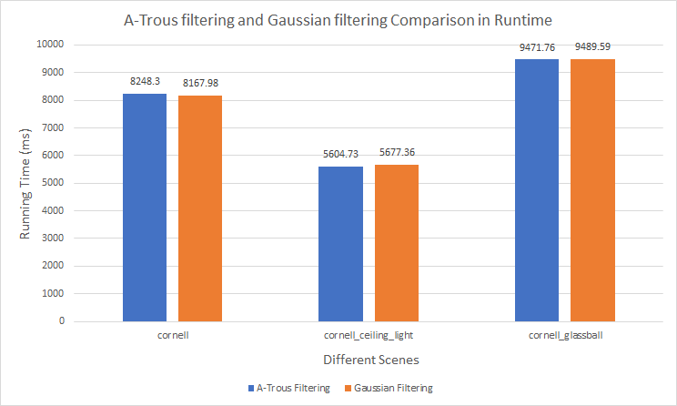

I implemented the basic Gaussian filtering with kernel size 17 x 17 and $\sigma$ = 15, which just simply blurs the image, as we can see. The Gaussian filtering only outputs a blurred images without details and take a little bit more time than A-Trous filtering, so A-Trous definitely outperforms Gaussian filtering. 

## References

- [Edge-Avoiding A-Trous Wavelet Transform for fast Global Illumination Filtering](https://jo.dreggn.org/home/2010_atrous.pdf)
- ocornut/imgui - https://github.com/ocornut/imgui
- Gaussian filter - https://en.wikipedia.org/wiki/Gaussian_blur 