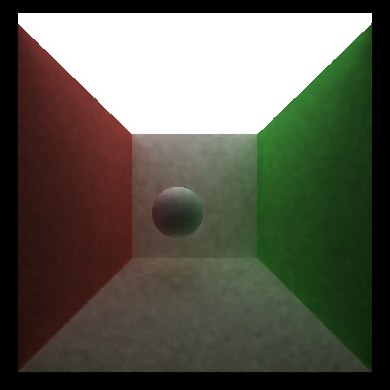
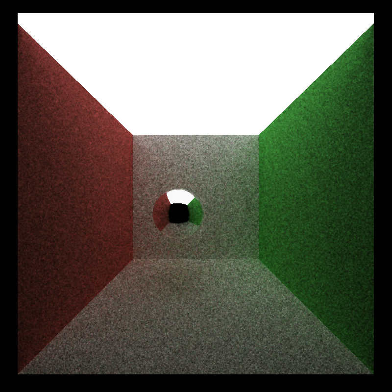
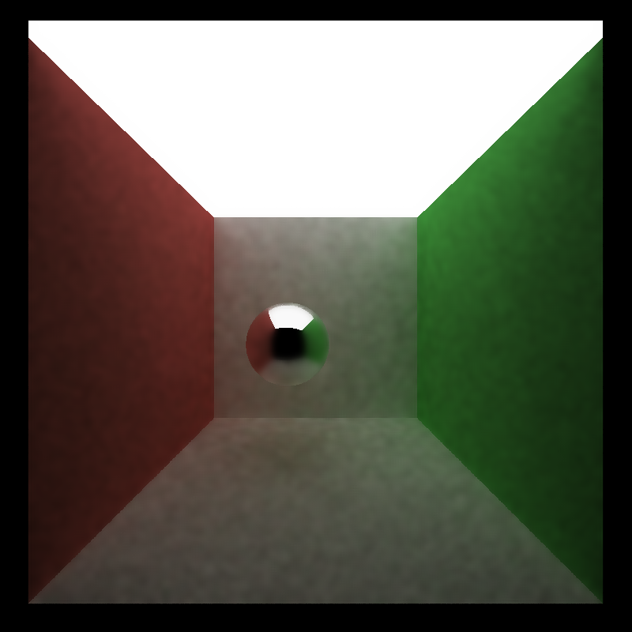
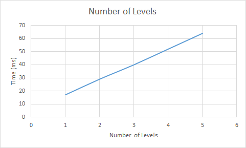
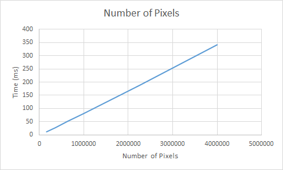
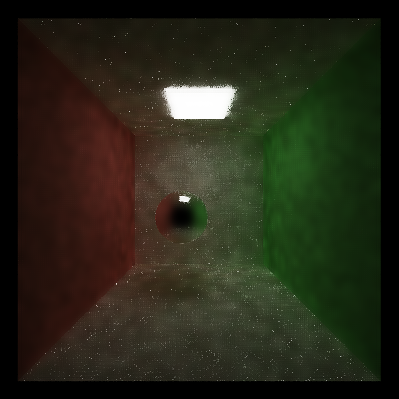
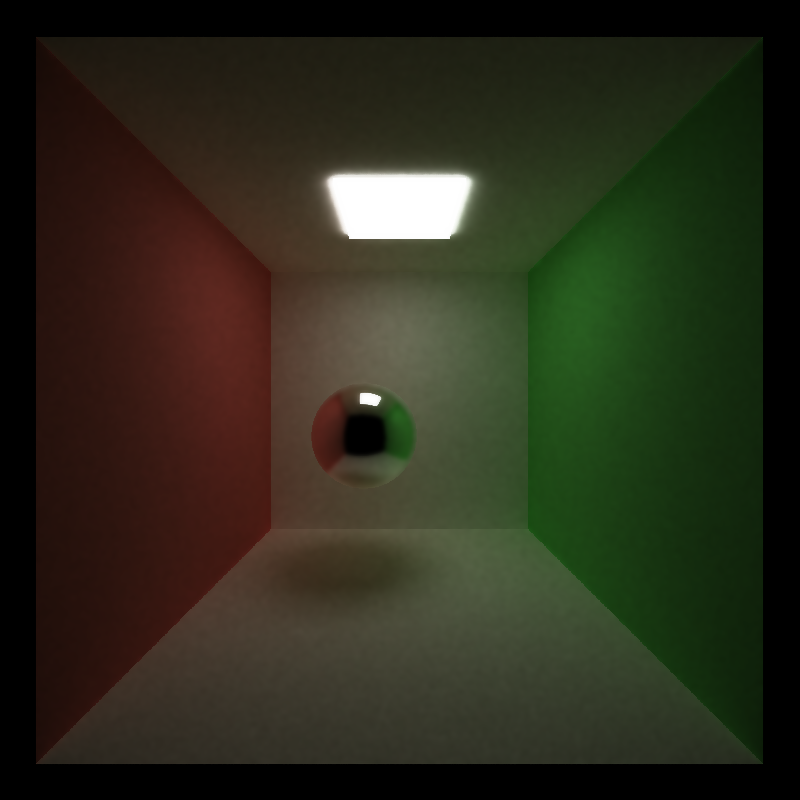

CUDA Denoiser For CUDA Path Tracer
==================================

**University of Pennsylvania, CIS 565: GPU Programming and Architecture, Project 4**

* Szeyu Chan
  * [LinkedIn](https://www.linkedin.com/in/szeyuchan11/)
* Tested on: Windows 10, i7-10510U @ 1.80GHz 16GB, MX250 2048MB (Personal Laptop)

### Features

A pathtracing denoiser based on the paper [Edge-Avoiding A-Trous Wavelet Transform for fast Global Illumination Filtering](https://jo.dreggn.org/home/2010_atrous.pdf).

### Results
| Original (10 spp) | Denoised |
| :----:  | :----: |
|||
|| |

### Performance Analysis
Since the filter is only applied to the image of the last iteration, the number of iterations (samples per pixel) will not affect the performance of the denoiser.  
For an 800 * 800 image with 10 iterations, the computation time of path tracing is 520 ms, while the computation time of applying a denoiser with 4 levels is only 52 ms. Thus, the overhead of applying this denoiser is very small.
#### Number of Levels of the Filter 
The number of levels will affect both the computation time and the quality of the results. Here are the results with different numbers of levels. The image size is 800 * 800.
| Number of Levels |Time | Result |
| :----:  | :----: | :----:|
| 1 | 17ms ||
| 2 | 29ms ||
| 3 | 40ms ||
| 4 | 52ms ||
| 5 | 64ms ||
  
  
It is clear that the computation time of the denoiser is linearly dependent on the number of levels.

### Image Size
Here we use the number of levels of the filter = 4.  
  
Similarily, the computation time of the denoiser is also linearly dependent on the number of pixels.

### Light Size
The samples per pixel are both 10.
| Larget Light | Small Light |
| :----:  | :----: |
|||

For the scene with a smaller light, the result is much more noiser. That is probably because the rays are less likely to hit the light so that the original image is too noisy to be smoothed.

Here is the result with 1000 spp. It looks better now.

