CUDA Denoiser
================

**University of Pennsylvania, CIS 565: GPU Programming and Architecture, Project 3**

* Janine Liu
  * [LinkedIn](https://www.linkedin.com/in/liujanine/), [personal website](https://www.janineliu.com/).
* Tested on: Windows 10, i7-10750H CPU @ 2.60GHz 16GB, GeForce RTX 2070 8192 MB (personal computer)

Building off of the [pathtracer](https://github.com/j9liu/Project3-CUDA-Path-Tracer) I implemented weeks before, this project adds a denoiser component based off of this paper: ["Edge-Avoiding À-Trous Wavelet Transform for fast Global Illumination Filtering"](https://jo.dreggn.org/home/2010_atrous.pdf). The intended effect of the denoiser is to apply a blur to the image, while still preserving edges that are between surfaces. Using the **positions and normals** of objects in the scene, the edges can be preserved by **applying weights to the blur** that determine how heavily (or lightly) it should be applied; the blur is least applied around **areas where the position and normal differences are high**. It follows that the greater the weight, the more blurred the corresponding pixels are. This weighting method can also be used to maintain *color differences* in the original image.

Although a Gaussian blur is desired, the computation for such a blur increases exponentially with the growth in filter size. Therefore, we approximate a Gaussian blur with an **À-Trous wavelet transform**, which takes the original coordinates of the Gaussian kernel and spreads them out over a larger area. This results in a sparse sampling of the image to approximate a bigger blur. A visualization of this effect is shown below.

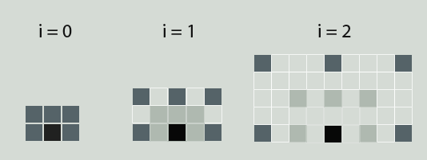

# Examples

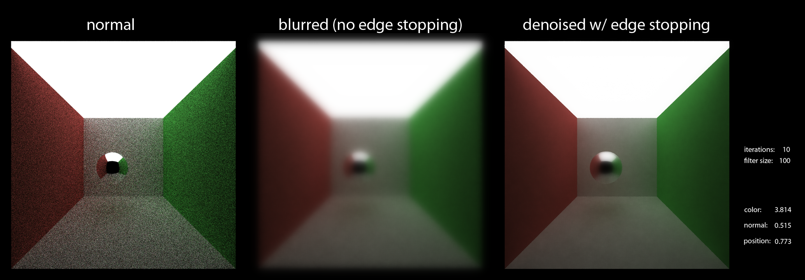

# Performance Analysis

## Qualitative Methods

To set a standard for the denoised images, a converged image is produced from the raw pathtracer at five thousand iterations. A comparison with this result will easily reveal flaws in the denoised image: for example, a small filter size with too few iterations results in scenes with **dark spots** (from the lack of blur) and **bright artifacts** (from an overly sharpened image, which happens when it lacks the blur to compensate).

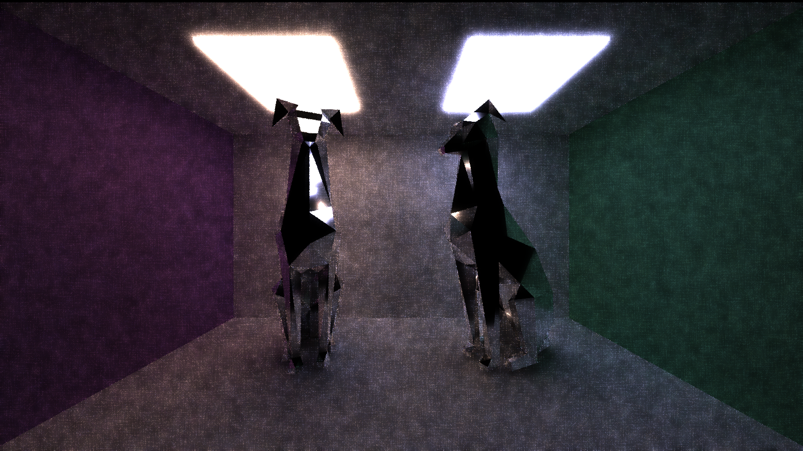

Additionally, if an image has fireflies (bright pixels of light), it is not sufficiently denoised.

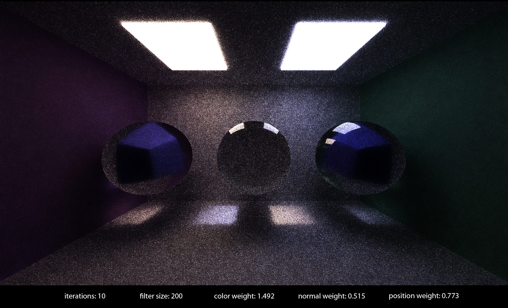

My standards include images that have smoothed out these artifacts so they are not blatantly noticeable. I tweak the color, normal, and position weights, as well as the number of iterations and the blur filter size, to optimize the quality of my renders. 

## Denoising Various Materials

The blur method works great for **diffuse surfaces with one solid color**. However, this compromises the edges in the image that are not defined by positions or normals of the objects in the scene. This is notable in denoised renders of **reflective and refractive materials**: in order to preserve edge quality in the refractions, the weight of the color differences must be lower so that less blur is applied. Unfortunately, this means the rest of the image will remain noisy (see previous image).

To achieve a smooth image, the color weight coefficient must be raised enough for the diffuse surfaces to appear smooth. But the lack of position and normal data for the refractions means that the reflection and refraction effects are blurred. 

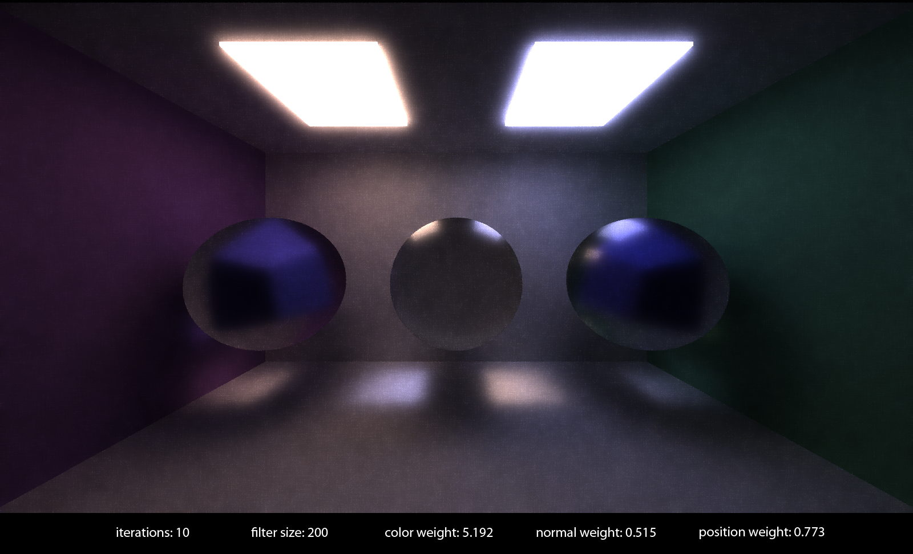

The reflections, caustics, and even the lights in the scene have a halo around them resulting from the blur, losing the sharpness they have in a raw pathtraced image.

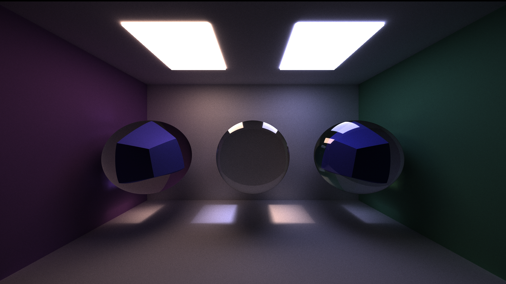

The overblurring also occurs in the procedural textures that I apply to my scenes. The patterns are still noticable, but they lack the clarity of the original.

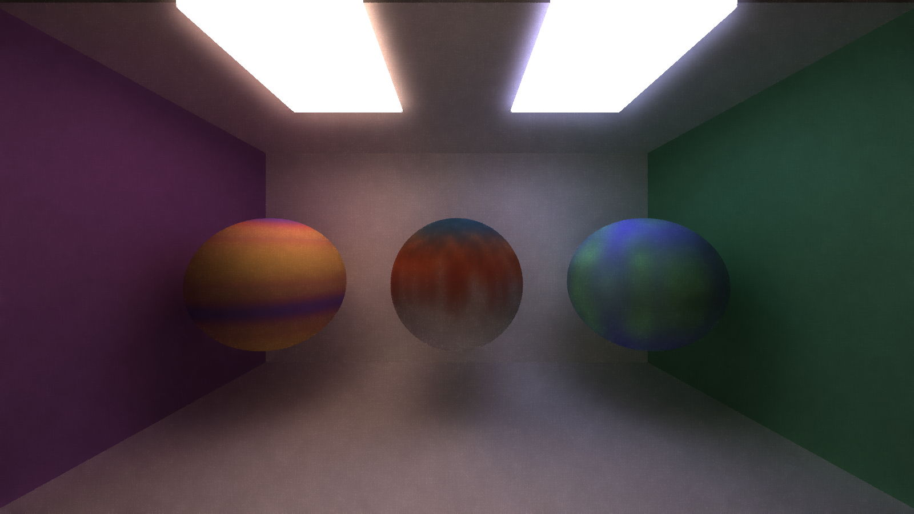

The pathtraced version at 5000 iterations is below, for reference. Also worthy of note is the lack of ambient occlusion in the denoised image.

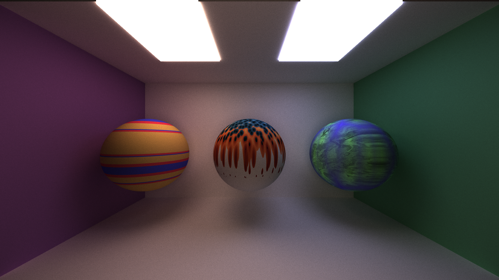

## Light Size and Image Quality

The denoiser relies on a limited amount of information from the first *n* iterations to approximate how the image looks with the rest of them. Thus, the amount of light in a scene affects this early information. Rays tend to be darker in scenes with smaller lights, so the denoiser has trouble compensating for the noise in the image:

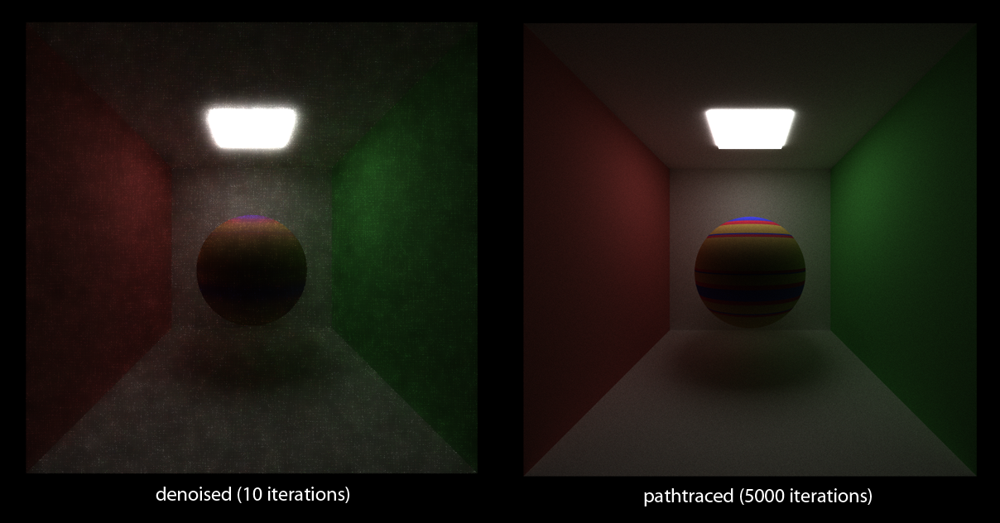

The same scene with a bigger light will yield better denoised results:

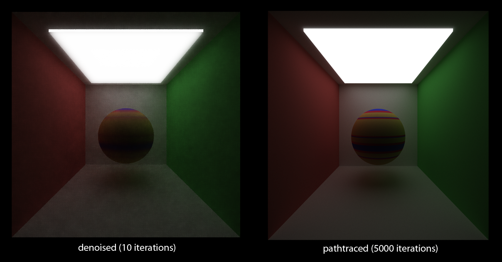

It follows that the denoiser is effective for well-lit scenes, but **struggles to render scenes with low lighting.**

## Iteration Number versus Quality

Although a 10-iteration difference between raw pathtraced images may be hard to notice, it can make a substantial difference in the denoised results. Here, the scenes are denoised in 10-iteration increments.

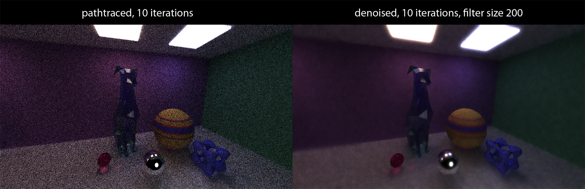
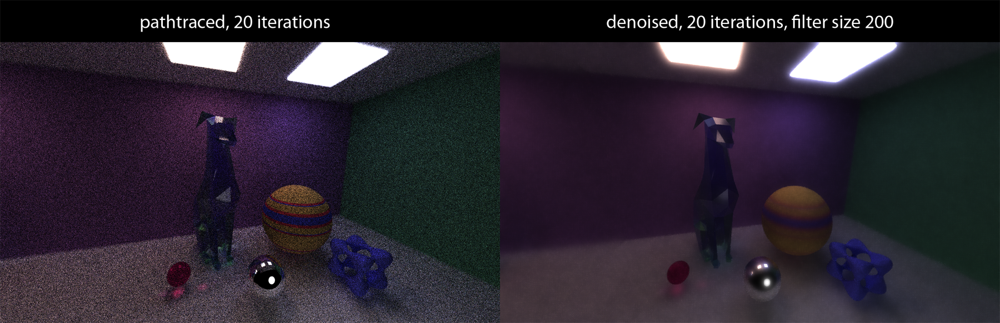
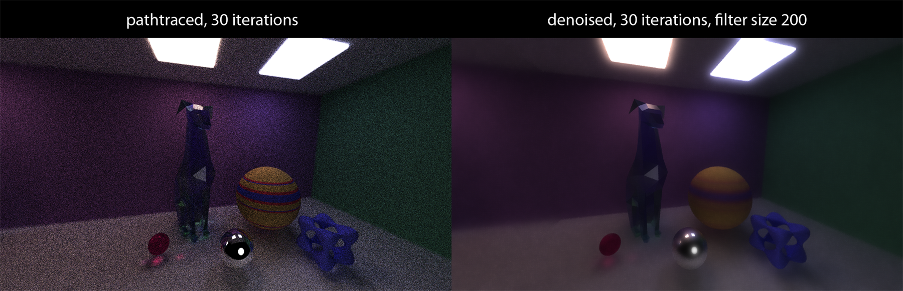

(There is actually a left wall in this scene; it's made of a reflective material, which is exposed by the blurring of the floor in the lower left of the image.)

Clearly, 10 iterations is too small and allows dark spots to form across the scene. Increasing to 20 iterations allows some of these spots to blend in, but the cloudiness is still noticable. Only at 30 iterations do the diffuse-colored walls and tanglecube look fairly close to the pathtraced version of this image at 5000 iterations.

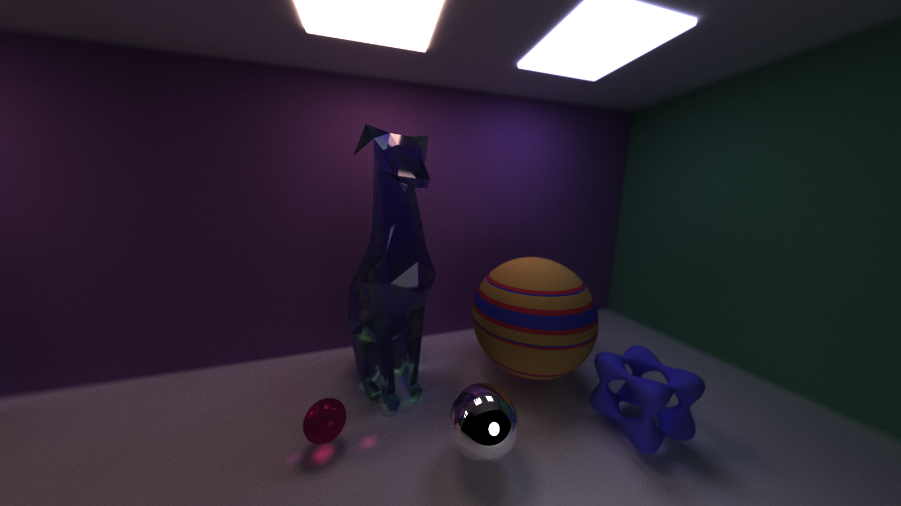

Of course, the reflections and caustics are blurred out in the denoised image, as addressed in a previous section. Still, this produces a decent result for diffuse surfaces, and 30 iterations appears to be the magic number for my scenes. This is **0.6%** of the 5000 iterations required to achieve the quality of the above image, saving an immense amount of time. It's up to the user to decide whether this is worth the tradeoffs in the quality of the scene.

## Quantitative Methods
Using the Performance Timer class provided in [Project 2](https://github.com/j9liu/Project2-Stream-Compaction/), I surrounded my `denoiseImage` call with calls to start and stop the GPU timer. I then took the average of all these iterations to determine what the average iteration time would be. Unlike the analysis of my pathtracer, I count all of the iterations in this process since it took a lot less time, and I never rendered more than 30 iterations.

## Iteration Time and Resolution

The resolution of the image, and thus the number of pixels in the image, affects how much time the `denoiseImage` kernel takes to complete its call. Initially, I tested different aspect ratios with a width of 1600 pixels, then expanded the test to widths of 2000 and 2500 pixels with the same aspect ratios for each.

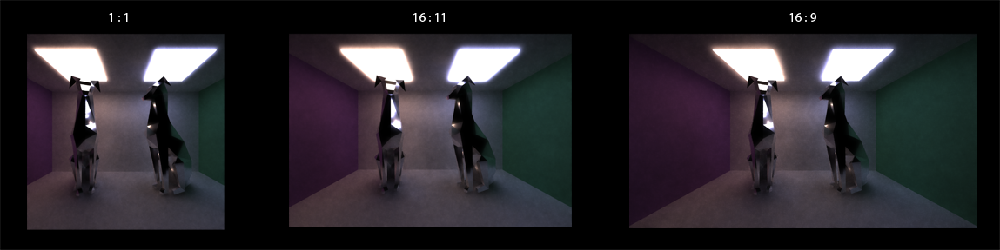

The average iteration time of the denoiser is graphed against these aspect ratios below.

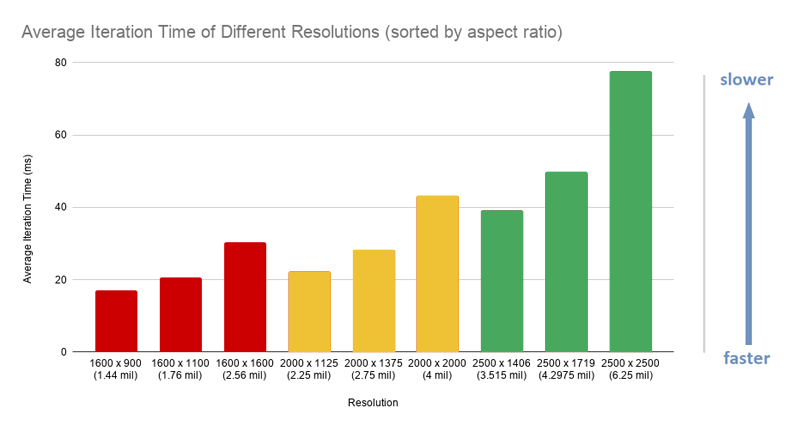

These trends generally show that increasing the number of pixels in the image lengthens the average time of an iteration, which is logical. To visualize the rate of this increase, the same data was transformed into the following line graph.

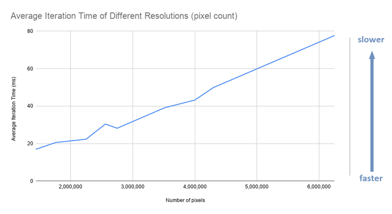

This demonstrates that the average iteration time increases linearly with the number of pixels in the image. Therefore, the image's denoising time scales well with the resolution.

## Iteration Time and Filter Size

Increasing the filter size of the blur should affect the iteration time because it requires more samples, and therefore more iterations within the blur algorithm. Plotting the average iteration time over a varying filter size results in the graph below.

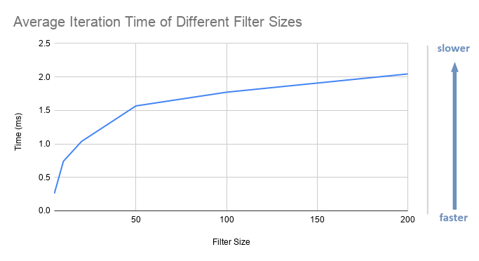

This graph takes form of a logarithmic curve, which aligns with how the number of À-Trous filter iterations depends on the log base 2 of the filter size. The visual differences of the filter size are apparent between a filter size of 5 and a filter size of 50, but once the size increases above 50, the differences are nearly undetectable.

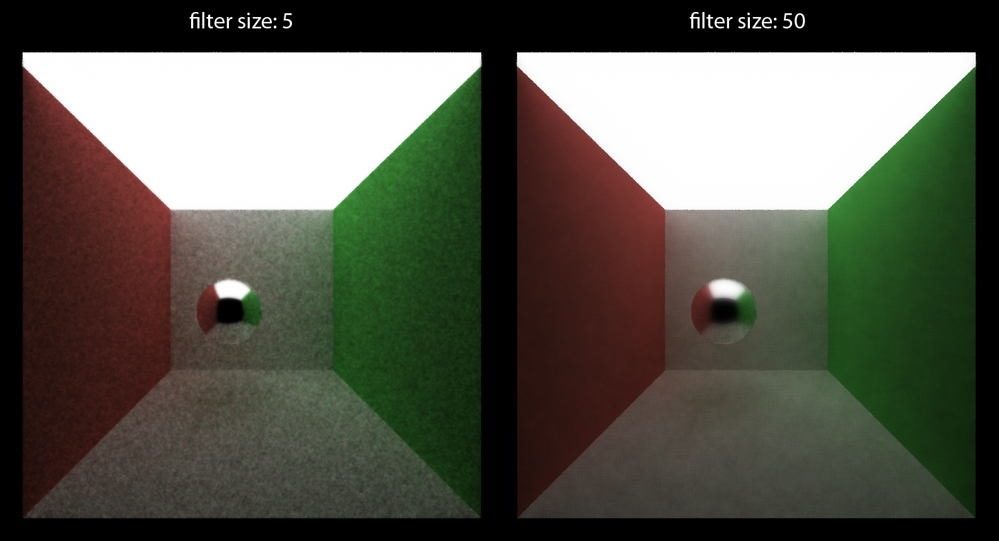
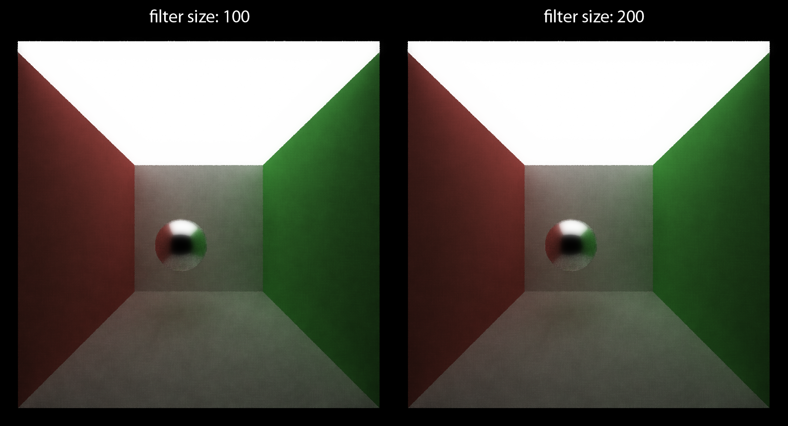

Running the last two images through an [image difference calculator](https://online-image-comparison.com/) shows that there is literally no difference between a filter size of 100 and a filter size of 200.

Therefore, while the denoising iteration time of the À-Trous filter scales well with the filter's size, a larger size will not necessarily improve the image.

# Bloopers

These are various bloopers from the implementation of my edge-stopping À-Trous filter, some worse than others.

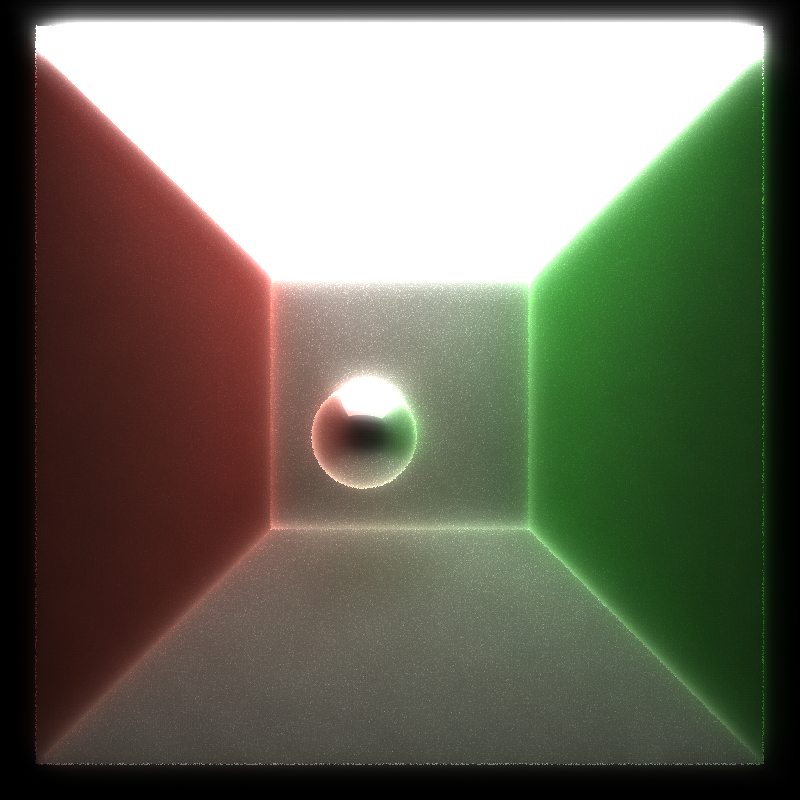
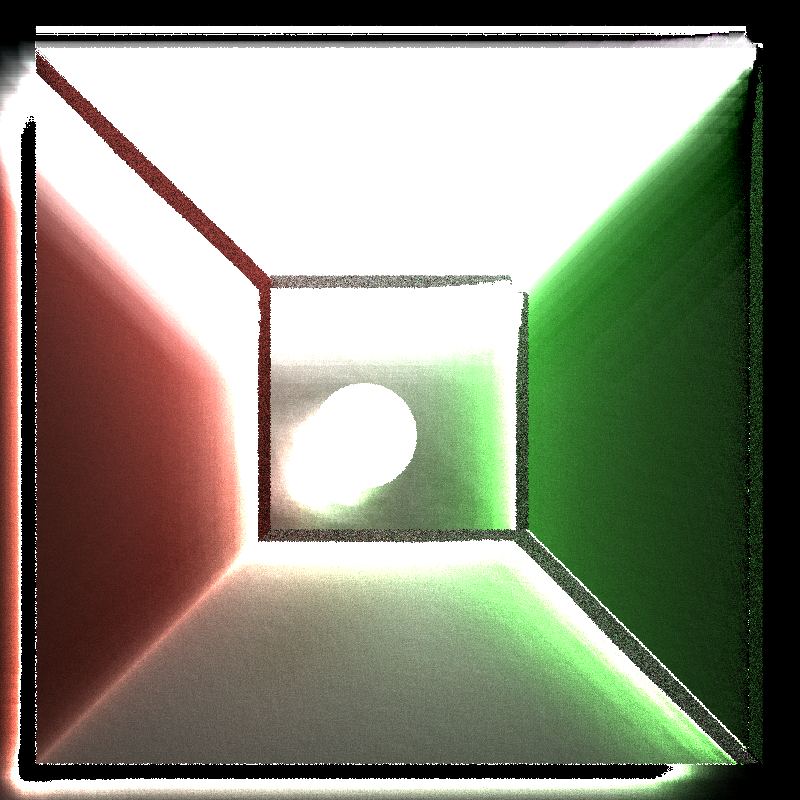
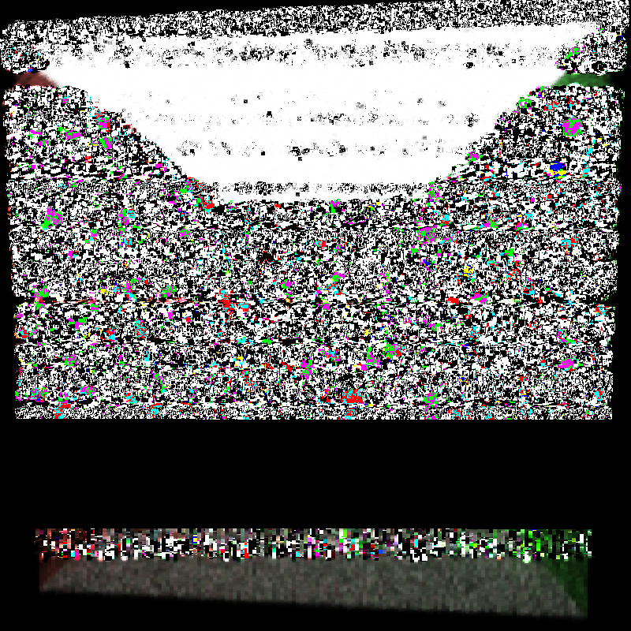
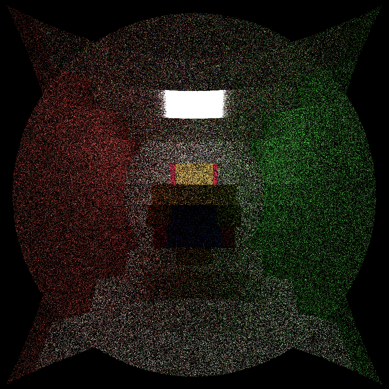
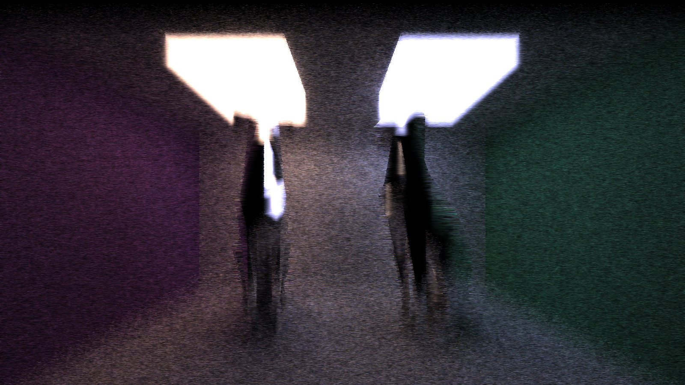