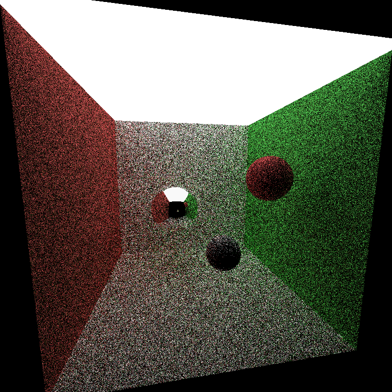
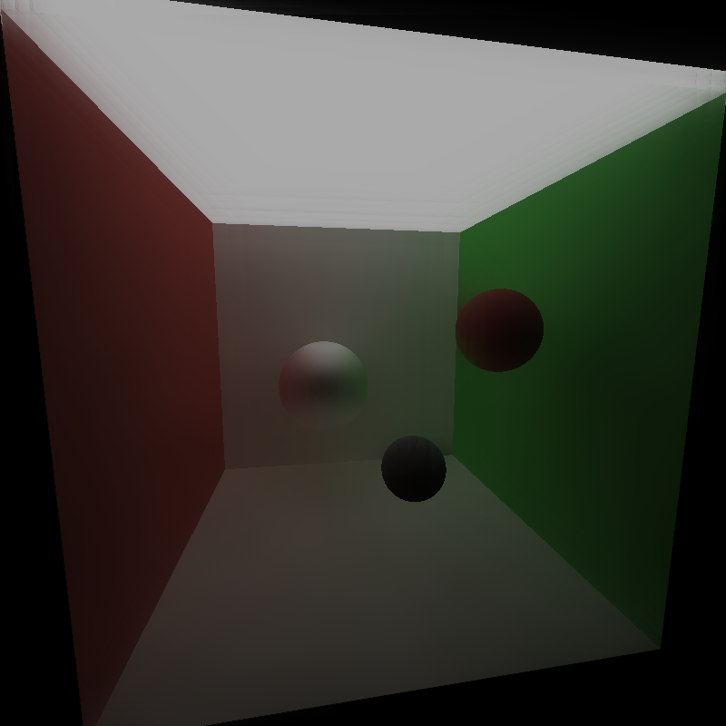
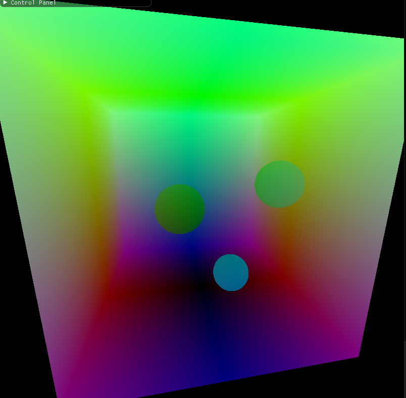
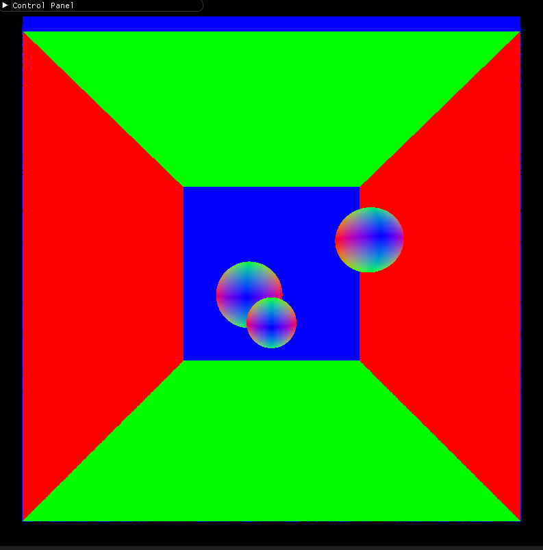
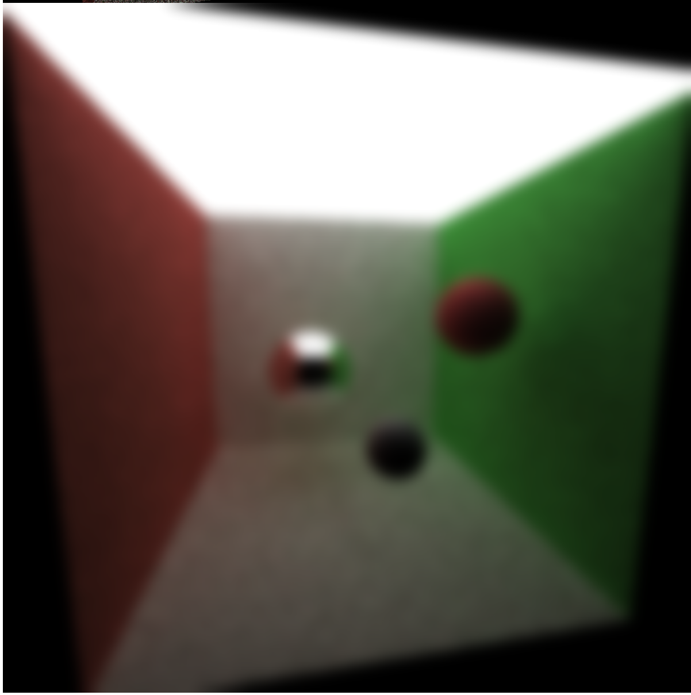
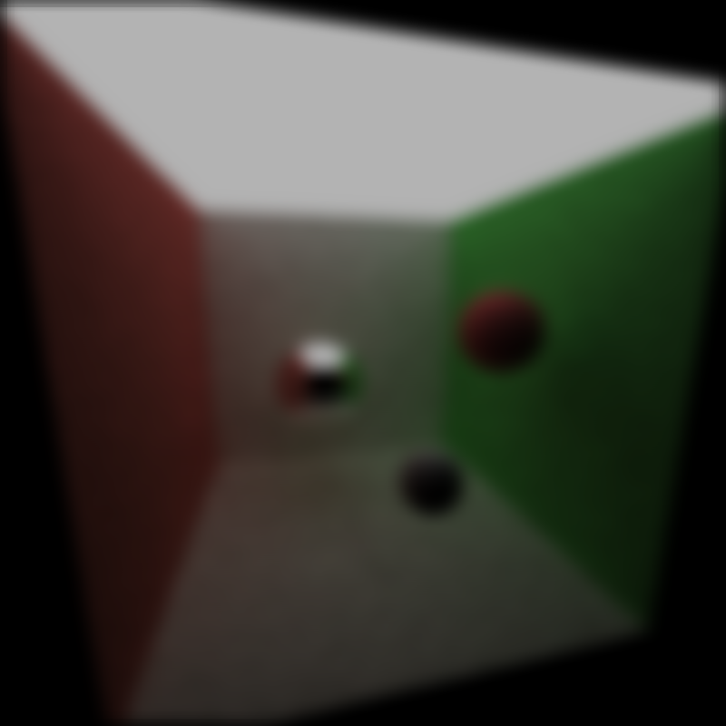
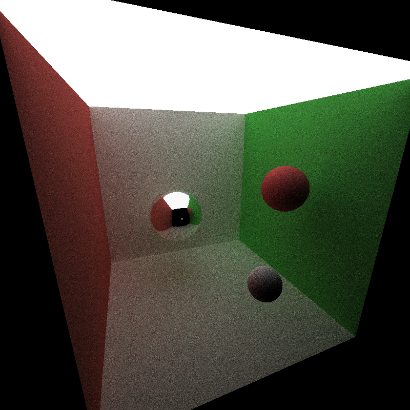
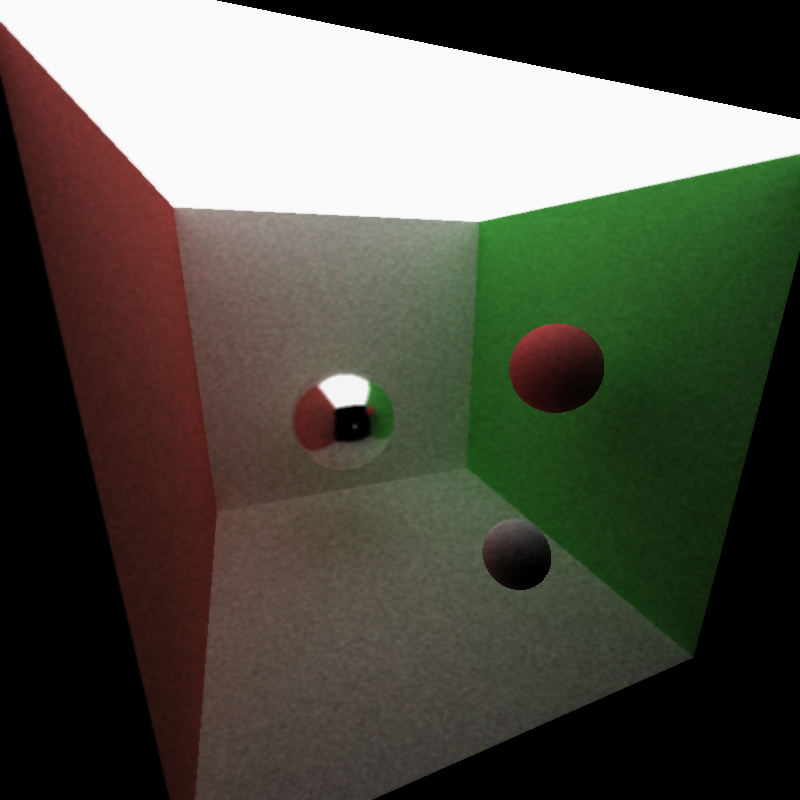
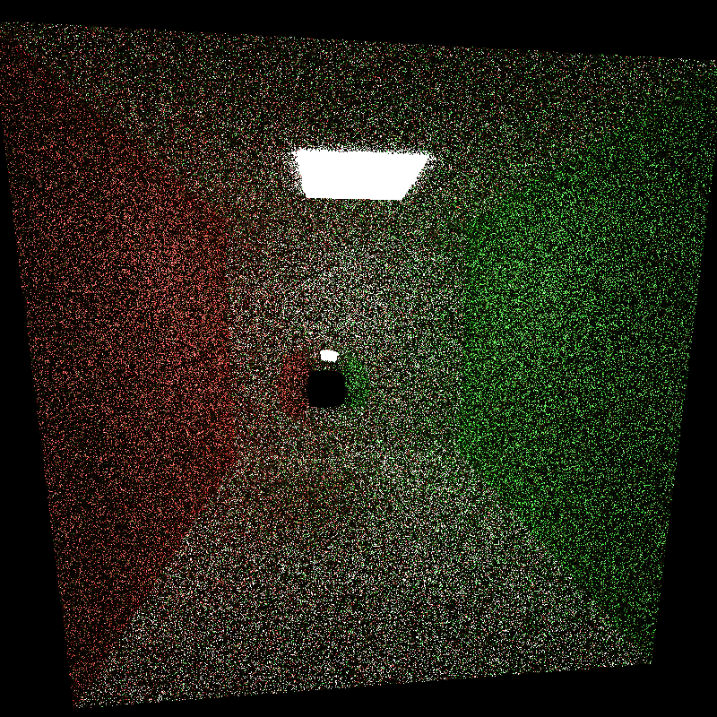
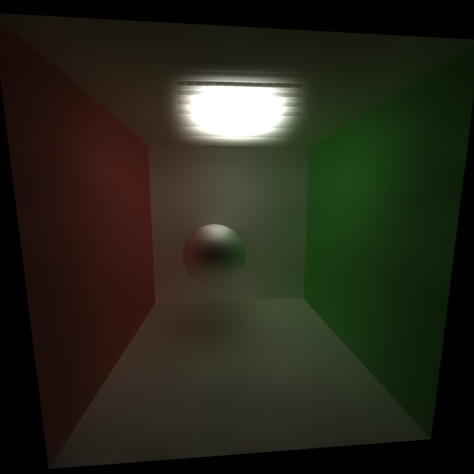

CUDA Denoiser For CUDA Path Tracer
==================================

**Denoising - Before and After**

 

**University of Pennsylvania, CIS 565: GPU Programming and Architecture, Project 4**

NAME: CHETAN PARTIBAN 

GPU: GTX 970m (Compute Capability 5.2) 

Tested on Windows 10, i7-6700HQ @ 2.60 GHz 16Gb, GTX 970m 6Gb (Personal Laptop) 

## Documentation

In this project I impelemented the paper "Edge-Avoiding À-Trous Wavelet Transform for fast Global Illumination Filtering" to denoise path-traced images with a low number of samples per pixel. This process starts by conducting a few iterations of sending out rays to trace in the environment to create an initial "raw" ray traced image as well as by caching a few of the important first-bounce characteristics -- namely the normal vector and intersection point of the first bounce. We can see some examples of those three input buffers to the algorithm visualized below. From left to right we see the raw ray traced image, the position vectors, and the normal vectors. 

  

The "À-Trous Wavelet Transform" component of the algorithm comes from using the À-Trous approximation to a convolving a gaussian kernel with the image. This involves doing a sort of iterative approximation. We can compare it to the opencv implementation of gaussain blur below (on the left is opencv gaussian blur and on the left is our À-Trous Wavelet Transform Blur. We can see the visual effect of the blurring looks pretty similar across the images, indicating that the approximation seems to be accurate enough for our use case.

 

In order to make the blurring look more acceptable we introduce an edge aware version of the blurring. In this version, as we convolve our À-Trous filter, we add additional weighting to down-weight samples that have very different color/normals/position when compared to the center pixel that the filter is going to write back into. When we add these rules we get more clear edges across objects whilst still blurring within the object. We can see this result below (left is raw image, right is the denoised version). These results were collected at 10 samples per pixel.

 

One thing that we can imediately see is that this method performs very well for diffuse surfaces but tends to fail in surfaces that are specular/refractive as any of the effects get blurred together because we are only looking at the first bounce cache of the position/normal vectors. This is a bit of a shame because we lose a lot of the detail that we gained from using ray tracing as opposed to rasterization. We could probably fix this by using this image as some sort of "rasterized image" that we combine with the raw ray-traced image to try to get back some of those details in the reflections. However, still, we can see that we do a good job at removing "holes" from the ray tracing noise whilst still maintaining clear definition between the different objects. We can see that with this approach, we can get "smooth" looking images with as few as 2 samples per pixel, whereas we don't get this effect for regular ray tracing for even 10 samples per pixel. The below visualizations are 2spp raw, 2spp denoised, 10spp raw.

  

Furthermore, this approach is much more efficient than running many iterations of SPP. This is particularly true because we require quadratically many samples to get a linear improvement in visual quality with path tracing. My implementation takes less time than 2 iterations of path-tracing (albeit using a not very optimized path-tracer). I imagine, even for a very optimized path-tracer it would take less than 5 iterations, but clearly provides a benefit of smoothing that the path tracer struggles with even at higher spp. I also found that the biggest gains happen at very low spp. We can see that for already decent quality images, the tradeoff of losing detail is not worth it for the benefit of some smoothness. Here we can see that even with a small kernel size for the algorithm, at 10spp the denoising does not seem worth it. Left is raw and right is denoised.

 

Interestingly, in situations where the light source is smaller we can see artifacts from the denoising the forms at certain parameter combinations. Here I show an image for a cornell box with a smaller light and we can see some clear artifacts around the light at the parameter settings. It seems that images with larger, more positionally discrete light sources do better for the algorithm. 

 

