CUDA Path Tracer
================

**University of Pennsylvania, CIS 565: GPU Programming and Architecture, Project 3**

* Haoyu Sui
  	* [LinkedIn](http://linkedin.com/in/haoyu-sui-721284192)
* Tested on: Windows 10, i5-9600K @ 3.70GHz 16GB, RTX 2070 SUPER 8GB 
* SM：7.5

### Denoise
**Fallguys**

| With denoising (32 pt iters) | Without denoising (32 pt iters) | Without denoising (2000 pt iters) |
| ------------------------ | ----------------------- | -----------------------|
| 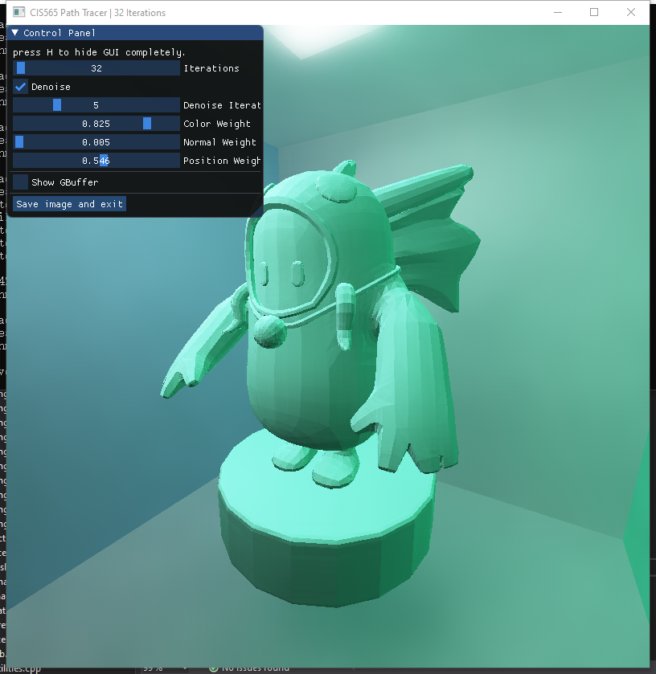 | 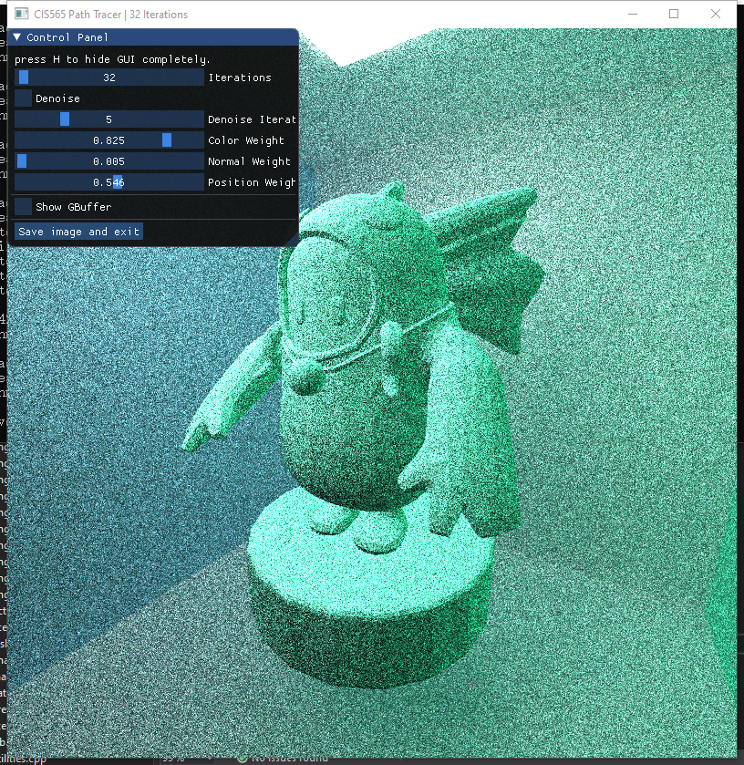 |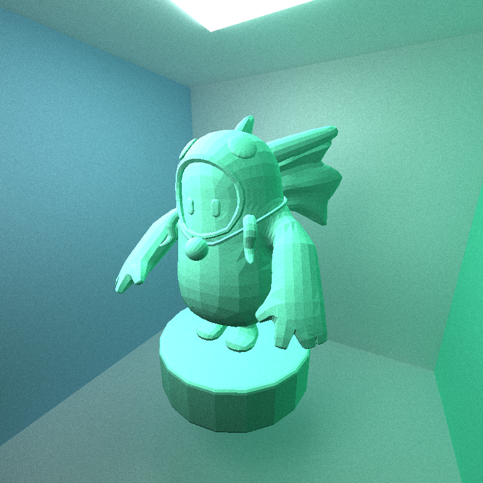|

As can be seen from the above three images, when PT has only 32 iterations, denoising can help to present a very good effect, which is similar to the PT result that has 2000 PT iterations and is without denoising. And the result of 32 PT iterations without denoising is very poor (the middle image).

**Ceiling light**

| PT reference (500 iters) | Denoise- 2 iters |
| ------------------------ | ----------------------- |
|  | 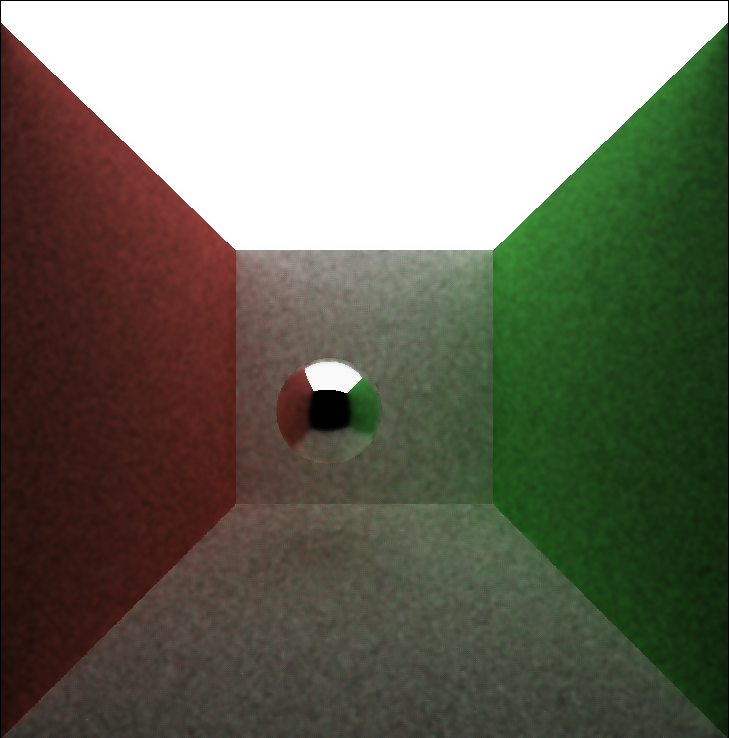 |

| Denoise- 5 iters | Denoise- 10 iters |
| ------------------------ | ----------------------- |
| 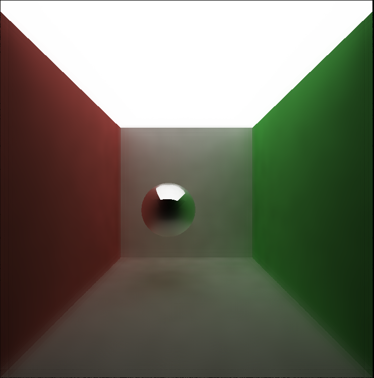 |  |

**Ceiling light VS Cornell**

| Ceiling light (20 pt iters / 5 dn iters)| Cornell (20 pt iters / 5 dn iters) | Cornell (100 pt iters / 5 dn iters) |
| ------------------------ | ----------------------- | --------------------------|
| 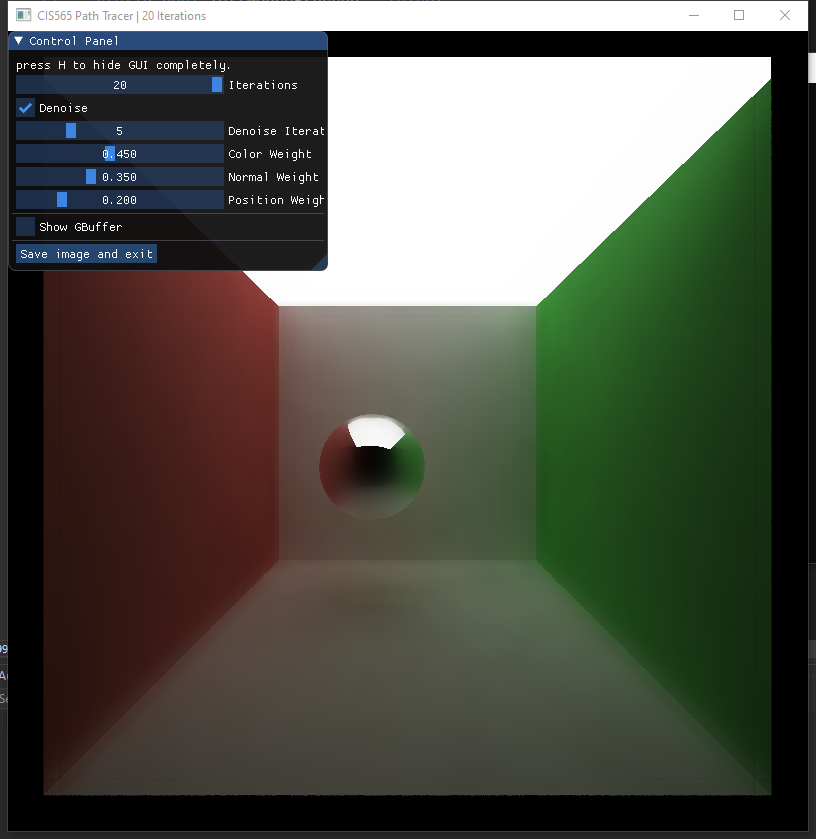 | 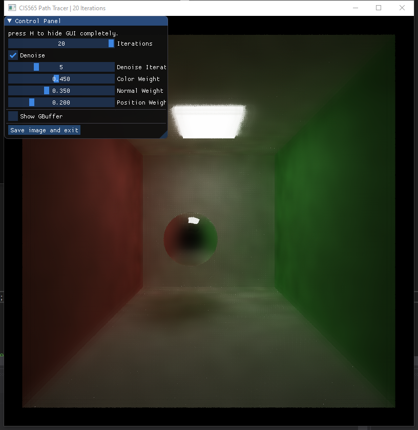 | 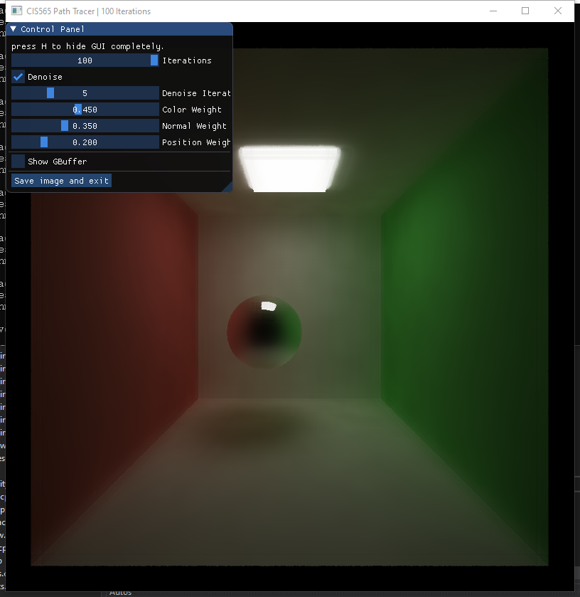 |

Comparing these two scenes, the denoising of the ceiling light scene under the same parameters can produce better results. For cornell, it may require more PT iterations to produce better results, such as in the third picture. I think it is because of the different light sizes, because for a smaller light, more noise will be generated under the same sampling times, so more samples are needed to achieve better results.

**Analysis**

| 10 iters for PT, 5 iters for denoising | 
| ------------------------ | 
| 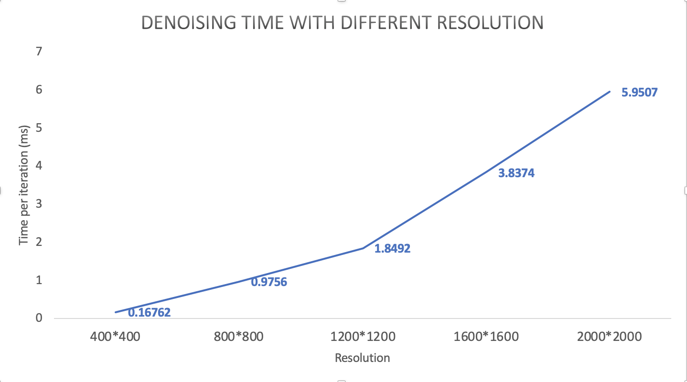 | 

According to the figure above, the denoising time increases with the increase in resolution, and there is a linear increase trend.

| Resolution: 800 * 800, 5 iters for denoising | 
| ------------------------ | 
| 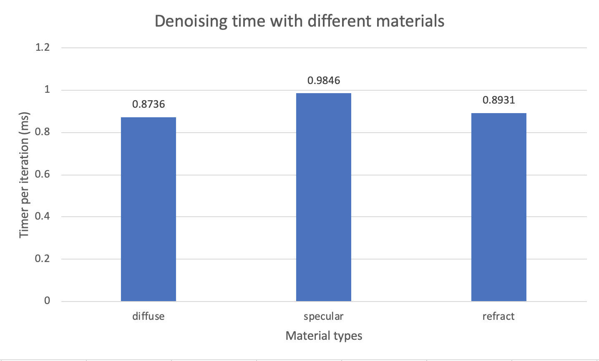 |

For different materials, from my results, it has almost no effect on the running time of denoising, because denoising processes the output image of path trace, so it has nothing to do with the material.

### Features
* Ideal diffuse surface
* Specular-reflective surface
* Stream compaction for path continue and termination 
* Sort rays with same material
* Cache first bounce
* Refraction with Frensel effects using Schlick's approximation
* Physically-based depth-of-field
* Stochastic Sampled Antialiasing
* Arbitrary .obj mesh loading
* Bounding volume intersection culling
* Stratified sampling method
* Object motion and motion blur

### Rendered images

**Arbitrary .obj mesh loading**

| Fallguys | Dragon |
| ------------------------ | ----------------------- |
|  |  |

**Specular surface reflection & Diffuse surface reflection & Refraction**

| Specular Surface | Diffuse Surface | Refraction |
| ---------------- | --------------- | -----------|
|  | 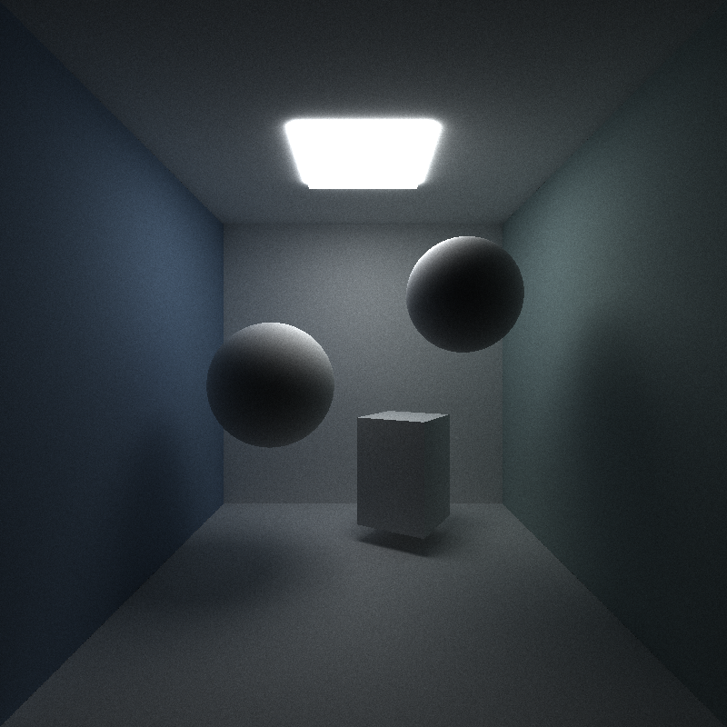 | 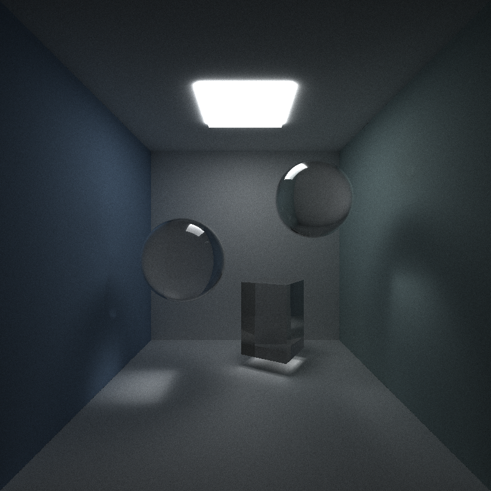

**Physically-based depth-of-field (Focal Distance = 7.f)**

| Lens Radius 0.0 | Lens Radius 0.5 | Lens Radius 1.0 |
| ---------------- | --------------- | -----------|
|  |  | 

**Stochastic Sampled Antialiasing**

| With Antialiasing | Without Antialiasing |
| ------------------------ | ----------------------- |
|  |  |

**Stratified sampling method**

| Naive Sampling | Stratified Sampling |
| ------------------------ | ----------------------- |
|  |  |

For stratified sampling comparsion, it can be seen from the figure that the difference is not very large, but some subtle differences can be found, for example, the shadow of the stratified sampling is a little bit more concentrated.

**Object motion and motion blur**

| Without Motion | Motion and motion blur |
| ------------------------ | ----------------------- |
|  |  |

### Performance Analysis

I calculated the average time spent in each depth loop in 200 iterations and got the result shown in the figure above. 

In terms of sorting rays, I originally thought that sorting would reduce the time it took because it would reduce the divergence in a thread warp, but from the results, on my computer, sorting actually reduced performance. It may because there are relatively few existing materials. When there are many kinds of materials in the scene, the performance should be improved.

For caching the first bounce, it can be seen from the chart that there is a slight improvement in performance, because the cache can only reduce the time to calculate the intersection for the first time, so the larger the depth, the smaller the performance improvement. And I think it has nothing to do with the number of iterations.

For bounding volume intersection culling, I tested the meshes with different numbers of triangles. From the table, it can be seen that when the number of triangles is relatively small, the effect of the bounding box is not obvious. As the number of triangles increases, the bounding box improves the performance more significantly.

### Third-party code

[tinyObj](https://github.com/tinyobjloader/tinyobjloader)

