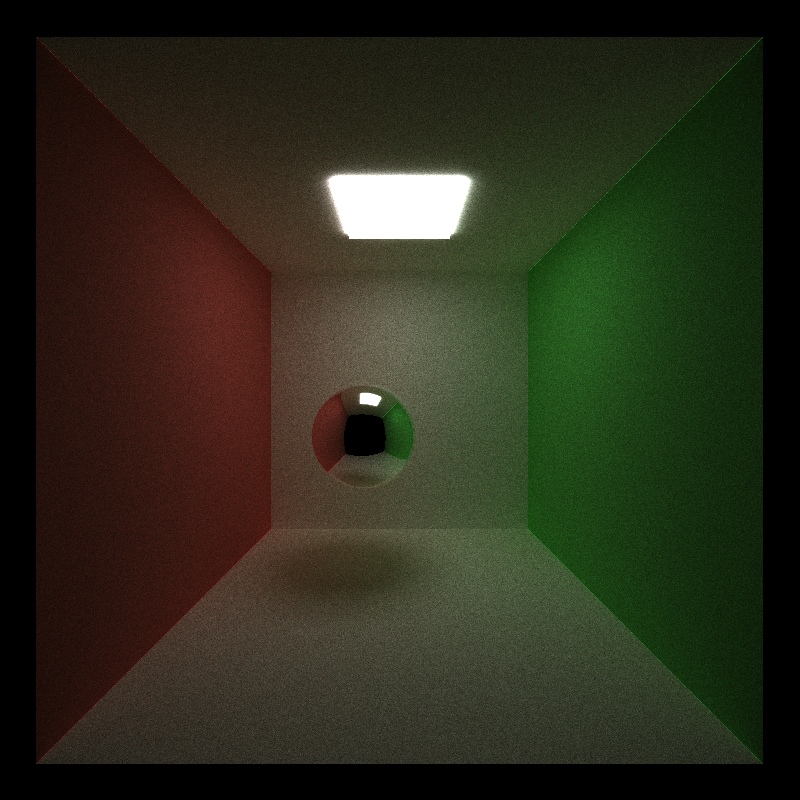
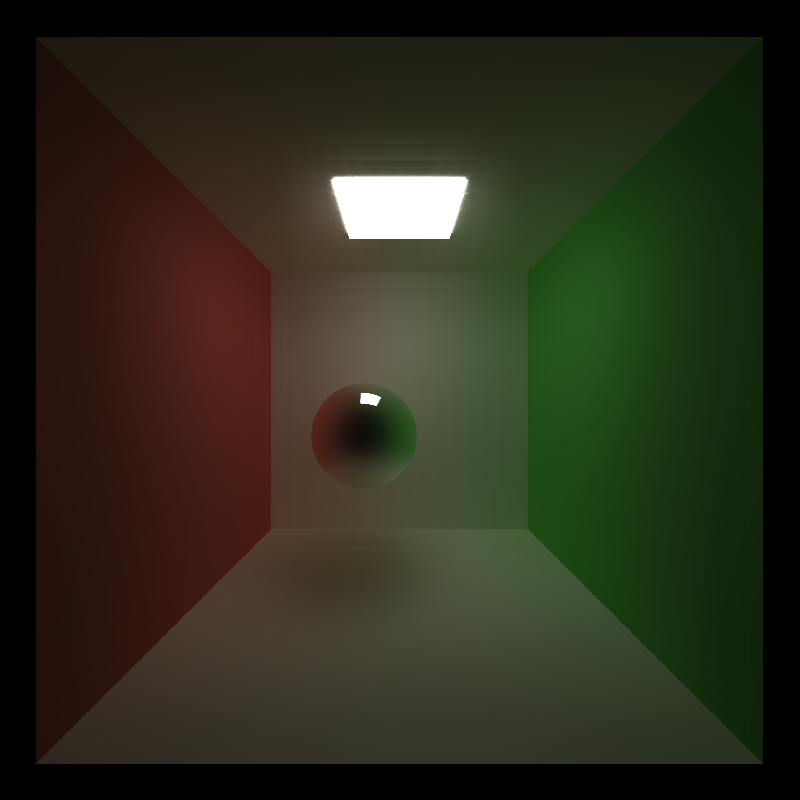
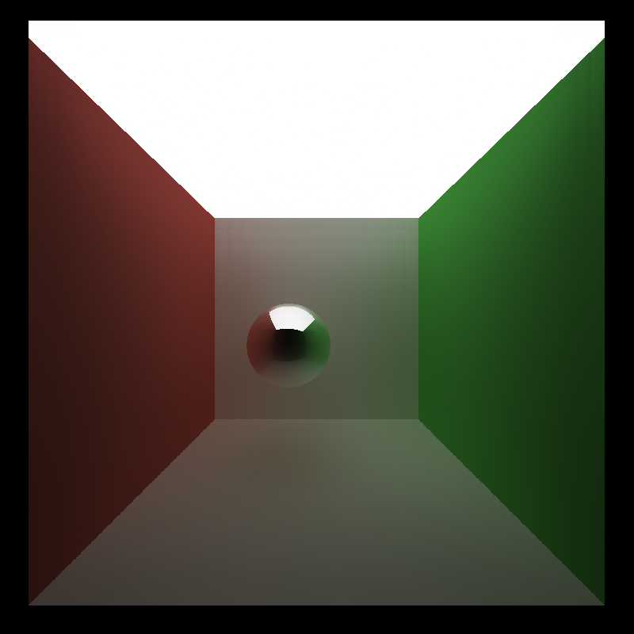
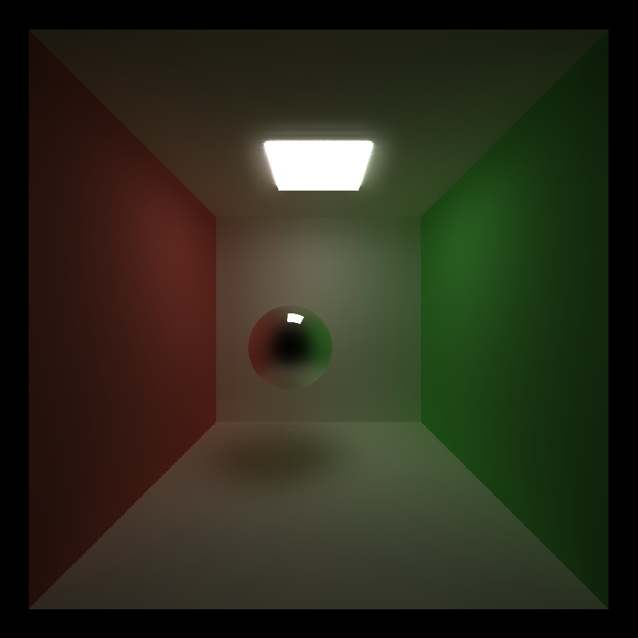

CUDA Denoiser For CUDA Path Tracer
==================================

**University of Pennsylvania, CIS 565: GPU Programming and Architecture, Project 4**

* Han Yan
* Tested on: CETS Virtual Lab

### Performance Analysis

* Influence on number of iterations

  * scenes/cornell.txt
  
    Without denoising, this scene takes about 4000 to 5000 iterations to get a smooth image. 
    
    With denoising, the image after 1000 iterations is already quite snooth.
    
    * Without denoising (1000 iterations)
    
    
    
    * Denoising (1000 iterations)
    
    
    
  * scenes/cornell_ceiling_light.txt
  
    Without denoising: 1500 iterations
    
    With denoising: 600 iterations
    
    * Without denoising (600 iterations)
    
    
    
    * Denoising (600 iterations)
    
    
    
  Denoising is more effective on scenes/cornell.txt, where the lighting is more sparse. This is reasonable since sparse lighting can create many 'black' pixels in the raw raytracing image, generating lots of noise. And denoising can seem more effective on noisy image. 

* Influence on run time

  * Tested with 'scenes/cornell.txt', filter size 80
 
    Without denoising, each iteration takes about ~37 ms. But when denoising is turned on, each iteration takes ~100 ms.
    So each iteration of filtering can take up to 12 ms. 

    This additional run time by denoiser can become more trivial in cases where raw path tracing takes longer time (eg. higher resolution). 

  * Tested with 'scenes/cornell_ceiling_light.txt', filter size 80
  
    Without denoising, each iteration takes about ~34 ms. But when denoising is turned on, each iteration takes ~96 ms.
    
    Each iteration of filtering still takes the same amount of time. 
    
* Effects on different material types

  I think it's more effective on diffusive materials. Since for diffusive materials, rays are scattered randomly, many rays may not reach emissive light source and the surface can be noisy. Denoising effectively mitigates the randomness and thus creates a smooth surface after fewer iterations. On the other hand, scattering on reflective/refrative surface is a bit more determined, so pixels neighboring each other can be quite similar even without denoising. 
  
* Varying filter size

  * Using 'scenes/cornell.txt', denoising with filter size 40 takes ~50 ms, whereas denoising with filter size 80 takes ~63 ms. Filter size 40 requires one less filtering iteration than 80, and the difference in time corresponds to exactly one iteration of filtered calculated previously. Smaller filter size reduces run time.
  
  * Visual comparison (1000 iterations)
  
  Filter size = 40
  
  
  
  Filter size = 80
  
  
  
  It seems to me that filter size 80 generates a smoother image. For different scenes, there could be different optimal filter sizes.
