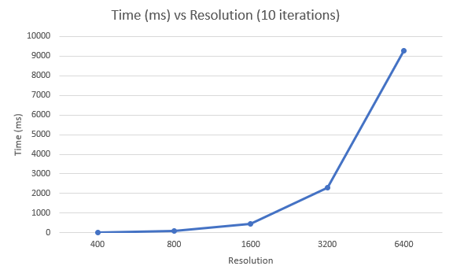
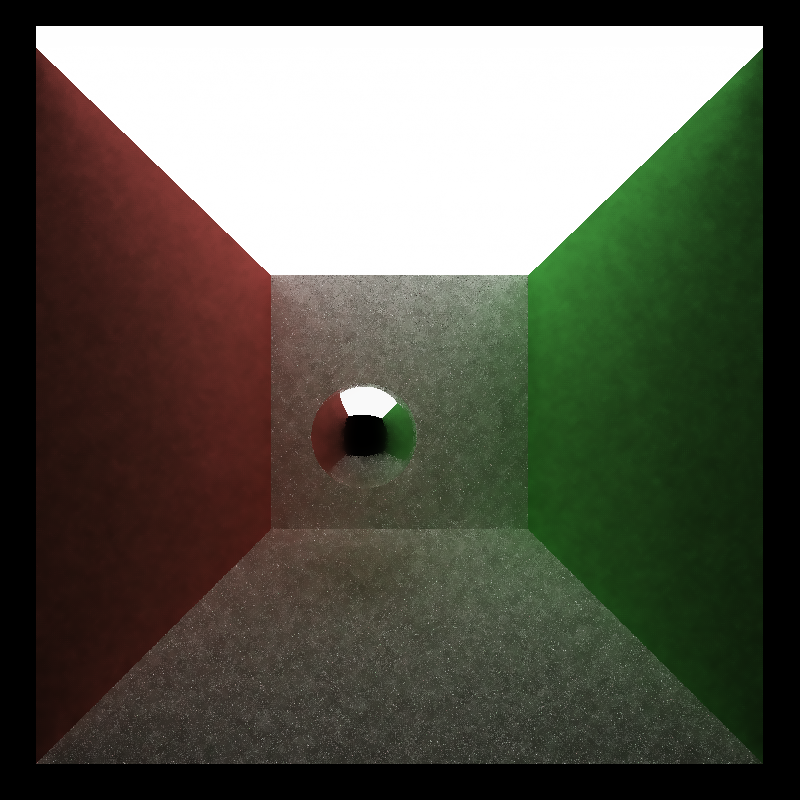
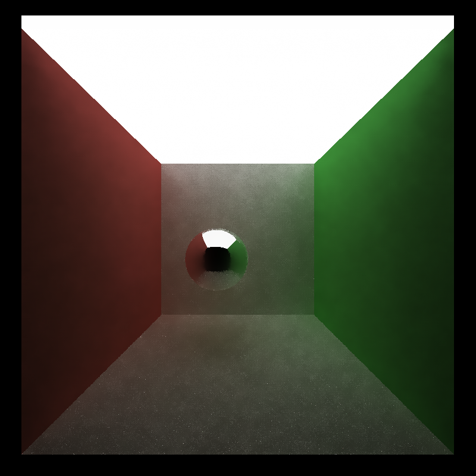
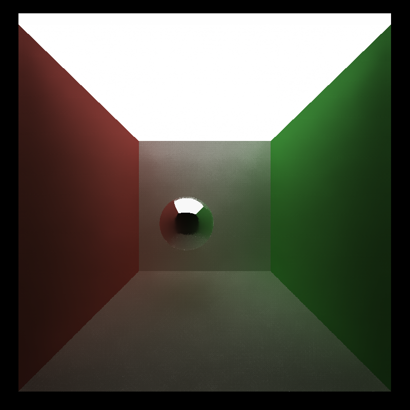
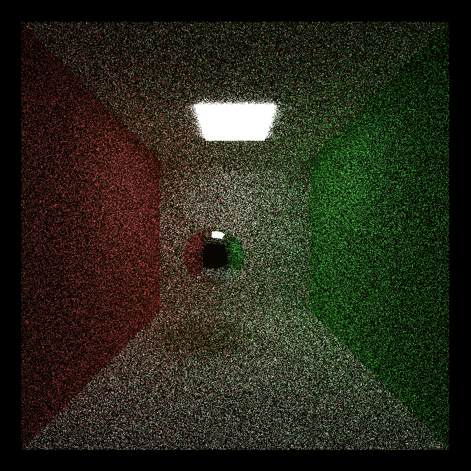

CUDA Denoiser For CUDA Path Tracer
==================================
**University of Pennsylvania, CIS 565: GPU Programming and Architecture, Project 3**

* Li Zheng
  * [LinkedIn](https://www.linkedin.com/in/li-zheng-1955ba169)
* Tested on: Windows CUDA10, i5-3600 @ 3.59GHz 16GB, RTX 2060 6GB (personal computer)

## Performance Analysis
- How denoising influences the number of iterations needed to get an "acceptably smooth" result?  
For the cornell_ceilight_light scene, the denoising takes 10 iterations to smooth the rendering result. Without denoising, it takes about 600 iterations to get an "acceptably smooth" result.

- How it impacts runtime at different resolutions?  
  
The runtime increases with resolution. Approximately, runtime is in proportion to resolution.x * resolution.y.

- How effective/ineffective it is with different material types?  
It works well with diffusive material, but is ineffective with reflective and refractive material. 

### Visual results and performance for varying filter sizes (10 iterations)
| Filter size | 10 | 30 |
|---|---|---|
| Visual result |||
| Time(ms) | 37.6 | 50.1 |

| Filter size | 60 | 80 |
|---|---|---|
| Visual result |||
| Time(ms) | 67.0 | 105.5 |

### Visual results  of different scenes
| small light | large light |
|---|---|
|||  

The scene with large light has a better performance. Because the traced rays have higher probability to hit the large lights and terminates earlier, which introduces less noise.
