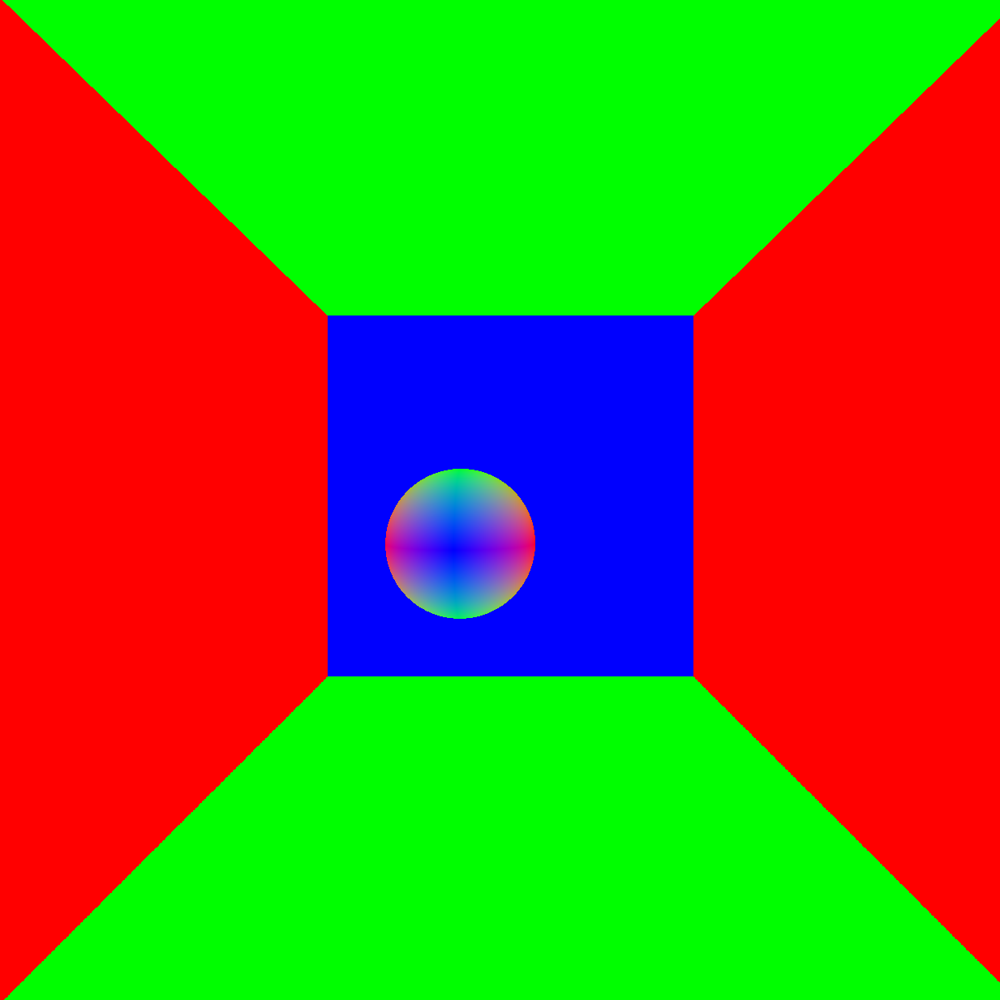

CUDA Denoiser For CUDA Path Tracer
==================================

**University of Pennsylvania, CIS 565: GPU Programming and Architecture, Project 4**

* Dayu Li
* Tested on: Windows 10, i7-10700K @ 3.80GHz 16GB, GTX 2070 8150MB (Personal laptop)  

## Features
* A pathtracing denoiser that uses geometry buffers (G-buffers) based on A-trous wavelet filter

## Effects
* Tested with 8 iterations and color-phi = 0.45, normal phi = 0.35, postion phi = 0.2.  

| Raw | Denoised |
| :----:  | :----: |
|||

### Performance Analysis
Since the A-Trous filter is applied only when the iterations are completed, the denoiser's performance is based on the image for the last frame thus has nothing todo with the iteration times. When the image size is 800 * 800, the time cost of applying a denoiser with 5 filter layers is about 5.88 ms.  

#### Number of Levels of the Filter 
Improving the filter layers will definitely cause a incrase of computation time. However, when the layer is greater than 5, imprving the number of layers will NOT change the effect of denoising apparently. Thus the filter layer number 4 or 5 is considered a proper value. The cost of time is linearly increasing with the number of layers which makes sense since the layers will affect the iteration times for a single for loop.  

Effects and time with differnt filter layers (phi values are 0.45,0.35,0.2).  

| Filter Layers |Time | Effect |
| :----:  | :----: | :----:|
| 1 | 2.14ms ||
| 3 | 4.65ms ||
| 5 | 5.37ms ||
| 10 | 11.66ms ||

### Change the phi values
Improving the phi values given in the A-Trous paper will lead to different weight values when the denoiser is applied, thus lead to a total different output image, however the change of the phi values will not change the time coplexsity of the denoiser thus makes no change in the time costs.  

* Tested with 8 iterations, changing the specified phi value to 3.0

| Status |Effect |
| :----:  | :----:|
| Large Color | |
| Large Normal | |
| Large Postion | |

### Change the Image size 
Change the size of image will change the pixel numbers and thus lead to an increase of executing time.  

* Tested with 10 iteartions with 5 filter layers  

|Image Size| Time |
|---|---|
| 800 * 800 | 5.37ms|
| 1600 * 1600 | 26.35ms|
| 3200 * 3200 | 53.37ms|
