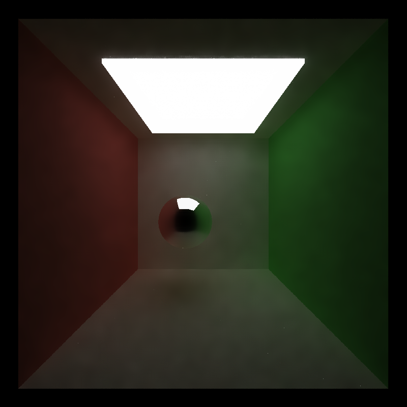

CUDA Denoiser For CUDA Path Tracer
==================================

**University of Pennsylvania, CIS 565: GPU Programming and Architecture, Project 4**

* Name: Gizem Dal
  * [LinkedIn](https://www.linkedin.com/in/gizemdal), [personal website](https://www.gizemdal.com/)
* Tested on: Predator G3-571 Intel(R) Core(TM) i7-7700HQ CPU @ 2.80 GHz 2.81 GHz - Personal computer

 

*Iterations: 10, Filter Size: 10, Blur Size: 63, Color Weight: 38.008, Normal Weight: 0.407, Position Weight: 3.862*

## Project Description ##

This project focuses on implementing a pathtracing denoiser that uses geometry buffers (G-buffers) to guide a smoothing filter. The technique is based on the [Edge-Avoiding A-Trous Wavelet Transform for fast Global Illumination Filtering](https://jo.dreggn.org/home/2010_atrous.pdf) paper by Dammertz, Sewtz, Hanika, and Lensch.

**Features **

* GBuffer Visualization
  * Position
  * Normal
  * Material base color
* Adjustable filter & blur size
* Guided denoiser

## GBuffer Visualization ##

GBuffers include scene geometry information such as per-pixel normals and per-pixel positions, as well as surface color for preserving detail in mapped or procedural textures. The current implementation stores per-pixel metrics only from the first bounce.

Position | Normal | Base Color
:---: | :---: | :---: 
 |  | 

## Denoising Parameters ##

Denoising parameters such as filter and blur sizes, number of iterations, color/normal/position weights are adjustable from the provided [Imgui](https://github.com/ocornut/imgui) GUI.

**Blur Size**

The examples below use the following other parameter values: *Filter Size = 5; Iter = 2; Col_W = 11.789; Nor_W = 0.610; Pos_W = 0.407*

Blur=10  | Blur=33 | Blur=80 | Blur=185
:---: | :---: | :---: | :---: 
 |  |  | 

Increasing the blur size allows more denoiser iterations since the blur size determines the largest expansion width the filter can reach. Applying more iterations result in smoother images, especially for very small number of path tracer iterations (which in this example is only 2). However, increasing the blur size has performance implications as well (check the Performance Analysis section below).

**Color Weight**

The examples below use the following other parameter values: *Filter Size = 5; Iter = 2; Blur Size = 80; Nor_W = 0.610; Pos_W = 0.407*

Col_W=1.423  | Col_W=4.675 | Col_W=15.244 | Col_W=30.285
:---: | :---: | :---: | :---: 
 |  |  | 

The results suggest that increasing the color weight results in smoother denoised results. Lower color weights result in denoised renders with more "fireflies" while larger weights give smoother results. However, it is important to mention that the impact of color weight may depend from implementation to implementation. The current adaptation from the A-Trous approach halves the color weight at each denoise blur iteration in order to smoothen smaller smaller illumination variations, as suggested by the paper.

**Light Size**

The examples below use the following other parameter values: *Filter Size = 5; Iter = 10; Blur Size = 63; Col_W = 28.455 Nor_W = 0.813; Pos_W = 3.862, Light intensity = 1*

Light Width = 3 | Light Width = 5 | Light Width = 7 | Light Width = 10
:---: | :---: | :---: | :---: 
 |  |  | 

However, increasing the light intensity may result in less smoother results with a lot of fireflies. The example below use a light width of 3 and intensity of 5, keeping the other parameters constant.

**Filter Size**

For the purpose of analyzing the effect of different sizes, I implemented the denoiser filter size to be adjustable rather than set to 5 as constant. The examples below use the following parameters: *Col_W = 16.667 Nor_W = 0.610; Pos_W = 0.813* The blur sizes are adjusted to allow the same number of blur iterations for different filter sizes.

Filter = 5, Blur = 80 | Filter = 9, Blur = 80 | Filter = 21, Blur = 81 | Filter = 43, Blur = 103
:---: | :---: | :---: | :---: 
 |  |  | 

The results suggest that changing the filter size doesn't seem to have a significant impact on denoiser results.

## Performance Analysis ##

I used a GPU timer to conduct my performance analysis on different settings in the denoiser. This timer is wrapped up as a performance timer class, which uses the CUDAEvent library, in order to measure the time cost conveniently. The timer is started right before the denoiser computation and is terminated once it ends. The measured time excludes memory operations such as cudaMalloc() and cudaMemset().

Measured runtimes are noted in miliseconds.

**Material Type**

Diffuse | Specular | Glossy | Fresnel
:---: | :---: | :---: | :---: 
23.068 | 23.1178 | 23.0083 | 22.999

**Filter Size**

5 | 9 | 21 | 43
:---: | :---: | :---: | :---: 
23.1178 | 73.1147 | 323.145 | 1343.26

**Blur Size**

16 | 33 | 80 | 173
:---: | :---: | :---: | :---: 
9.5744 | 18.6659 | 23.1178 | 27.8777
