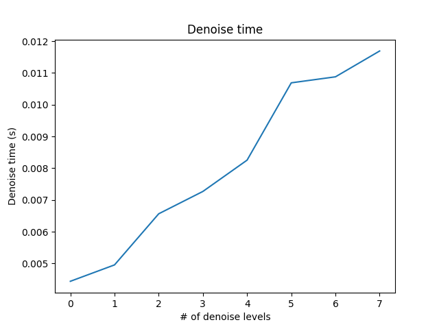

CUDA Denoiser For CUDA Path Tracer
==================================

**University of Pennsylvania, CIS 565: GPU Programming and Architecture, Project 4**

* Shenyue Chen
  * [LinkedIn](https://www.linkedin.com/in/shenyue-chen-5b2728119/), [personal website](http://github.com/EvsChen)
* Tested on: Windows 10, Intel Xeon Platinum 8259CL @ 2.50GHz 16GB, Tesla T4 (AWS g4dn-xlarge)

## Performance analysis

### Render time 
For the cornell box scene, we measure the average time per iteration, which is quite stable, around 0.11s per iteration.

### Denoise time
To analyze the time used to denoise, first we consider the image of 800 * 800 resolution, we change the number of filter levels. We could observe that the time needed to denoise increases for the first levels but remain stable when the stepwidth gets too big, which is expected. Compare the denoise time with the render timer per iteration we get from the previous section. The denoise time is roughly equal to one iteration for the cornell box scene.

#### Denoise performance for different levels
We can observe the denoise performance for different levels under the same cornell scene.

### Denoise in different resolutions
To measure the denoise time in different resolutions, we very the resolution from 400 * 400 to 1000 * 1000, all using 5 denoise levels. From the plot we can see that the denoise time increases in a linear manner.

