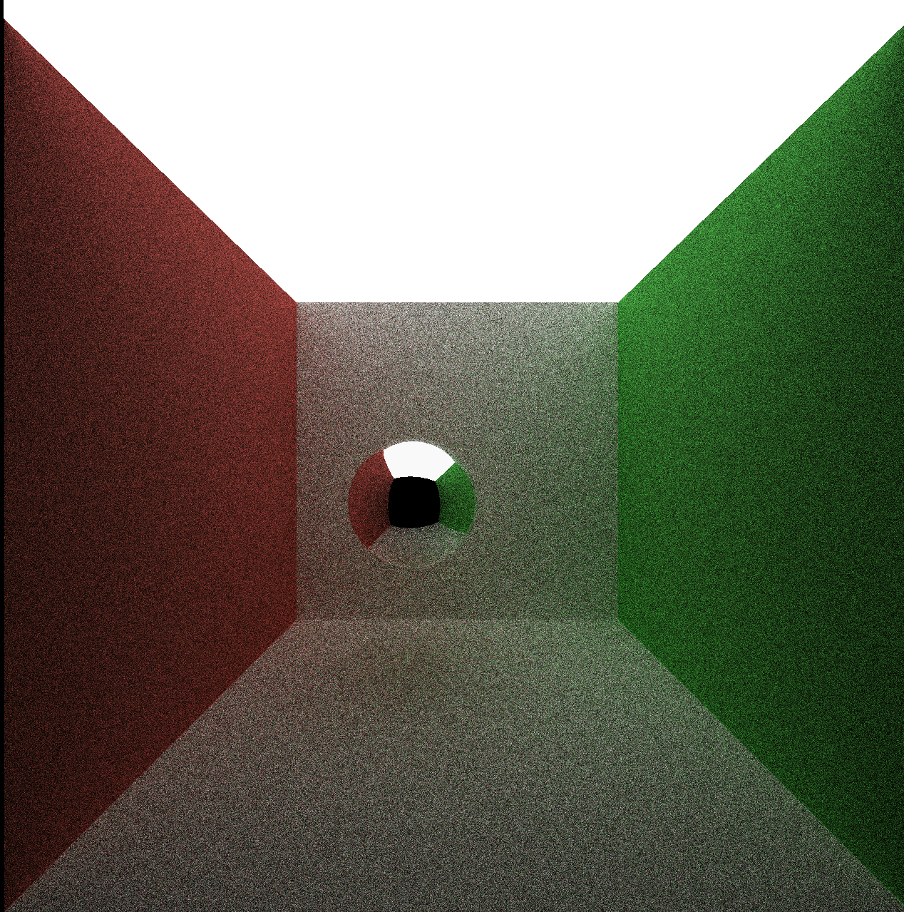
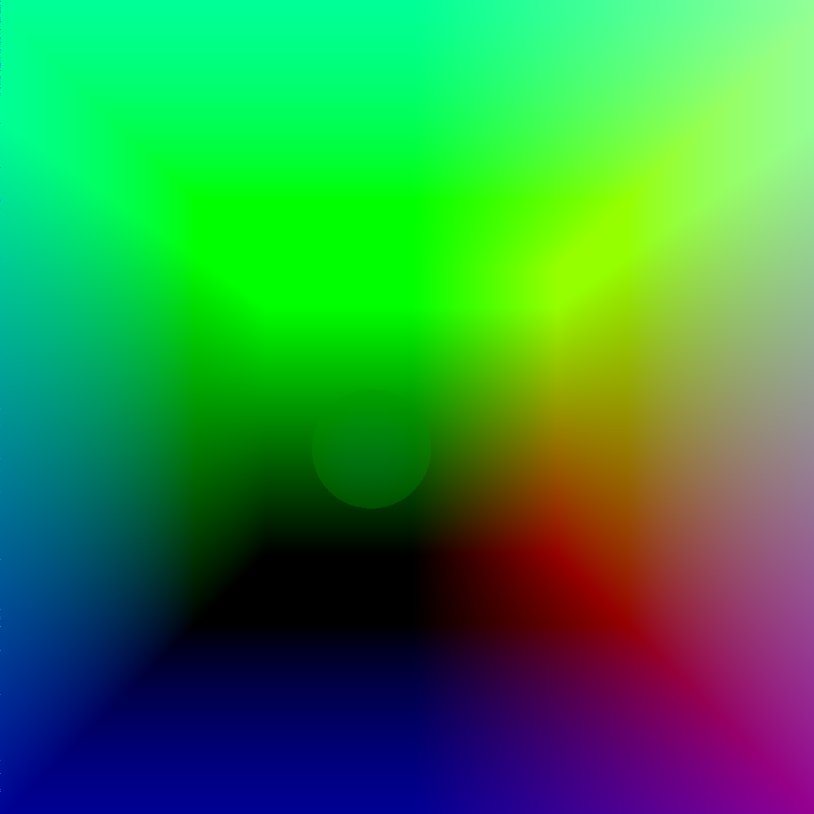

CUDA Denoiser
================
**University of Pennsylvania, CIS 565: GPU Programming and Architecture, Project 3**
* Haorong Yang
* [LinkedIn](https://www.linkedin.com/in/haorong-henry-yang/)
* Tested on: Windows 10 Home, i7-10750H @ 2.60GHz 16GB, GTX 2070 Super Max-Q (Personal)

  

### Features:
  * A Trous filter denoising based on the paper: [Edge-Avoiding À-Trous Wavelet Transform for fast Global
Illumination Filtering](https://jo.dreggn.org/home/2010_atrous.pdf)
  

### Denoise Results
Unsmoothed           |       Smoothed           
:-------------------------:|:-------------------------:
|  |

### GBuffer visualizations
positions         |   normals
:-------------------------:|:-------------------------:
|  |

### Optimization

