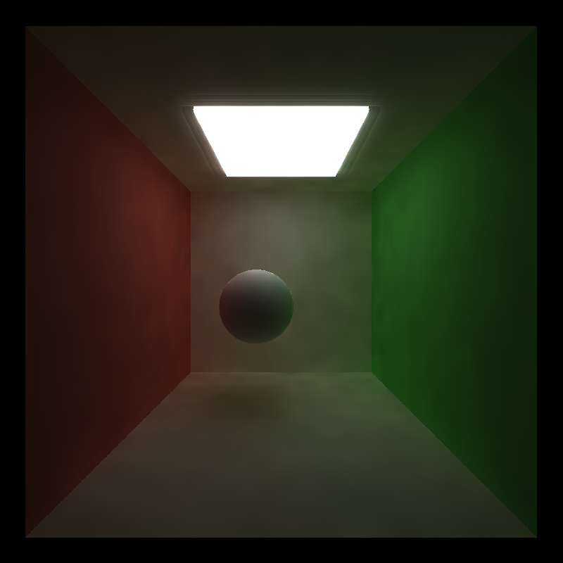

CUDA Denoiser For CUDA Path Tracer
==================================

**University of Pennsylvania, CIS 565: GPU Programming and Architecture, Project 4**

* Hanyu Liu
  - [personal website](http://liuhanyu.net/) 
* Tested on: Windows 10, Intel(R) Core(TM) i7-7700HQ CPU @ 2.80GHz 16.0GB, GeForce GTX 1050 (Personal)

### Introduction

(Left: No denoising, Right: With A-Trous Filter Denoising. As we can see, the right side is much more smooth and appear much more converged)

Denoisers in path tracers help produce a smoother appearance in the resulting image using fewer samples per pixel. In this project, I implemented a pathtracing denoiser that uses position and normal G-buffers to guide edge detection in a blurring filter. The technique is based on the paper "Edge-Avoiding A-Trous Wavelet Transform for fast Global Illumination Filtering," by Dammertz, Sewtz, Hanika, and Lensch (https://jo.dreggn.org/home/2010_atrous.pdf) 

### Results

(10 iterations, 1600 x 1600, filter size: 128, color weight: 3.428, normal weight: 0.005, position weight: 0.191)

### Filter Components

In order to generate the denoising filter, we need to create a gbuffer of the normals and positions. We also must successfully blur the image before taking into account the edges. 

| Normals GBuffer          | Positions GBuffer        | Blur with No Weights | Final result                     |
| ------------------------ | ------------------------ | -------------------- | -------------------------------- |
|  |  |   |  |

### Parameters

##### Filter Size

As we can see above, have a larger filter size results in much smoother appearance on the diffuse walls. 

##### Color Weight

As we can see above, as the color weights increase, the original noise artifacts contribute less and less to the scene. The biggest difference happens between a color weight of 1 and 2. 

##### Normals Weight

As we can see above, as the normals weights increase, the differences in normals of the scene are considered less and less. The biggest difference happens between a normals weight of 0.01 and 0.1. 

##### Positions Weights

As we can see above, as the positions weights increase, the differences in positions of the scene are considered less and less. The biggest difference happens between a positions weight of 0.2 and 0.4. 

### Performance Analysis

Since denoising involves sampling neighboring pixels repeatedly, it will most definitely increase the performance time, resulting in slower renders. But as for how much slower...

Turns out, if we are only doing one blur iteration, with a filter size of 4, the performance time is about the same. However, if we have a filter size of 128, the performance time is about twice as slow!

Here we see that as the filter size doubles, the time it takes to render 10 iterations with the denoiser linearly increases. This makes sense because for every double increase of the filter size, the algorithm needs to do one more additional blur iteration, thus converting the exponential increase of the filter size into a linear increase of performance. 

Even though the iterations take longer with the denoiser, we can get a smoother image much faster. To generate an acceptably smooth image without a denoiser, you would need thousands (if not more, depending on the light source) of iterations. However, generating an acceptably smooth image with a denoiser only takes 5 to 8 iterations (in this example case)! Overall, this is a very very large performance gain.

When we increase the resolution of our images, we see that both the performance time of the denoiser and no-denoiser increase linearly. However, the denoiser performance time increases at a higher rate. This is most likely due to the fact that at each pixel, the denoiser takes a set amount of time longer (depending on the filter size), and this factor contributes to the steeper slope. 

This technique is a lot less realistic in lower light levels: 

Here we see more black spots on the walls even at the same filter size as the more lit images. This is because there is more black noise that is blurred into the results. Also, we see that the diffuse material is much more realistic than the specular material. The reflections in the specular material become blurred out, making it look like a glossy sphere instead of a perfect mirror. 

### Blooper

Ah yes, no noise at all... at least the edge detection is somewhat there??