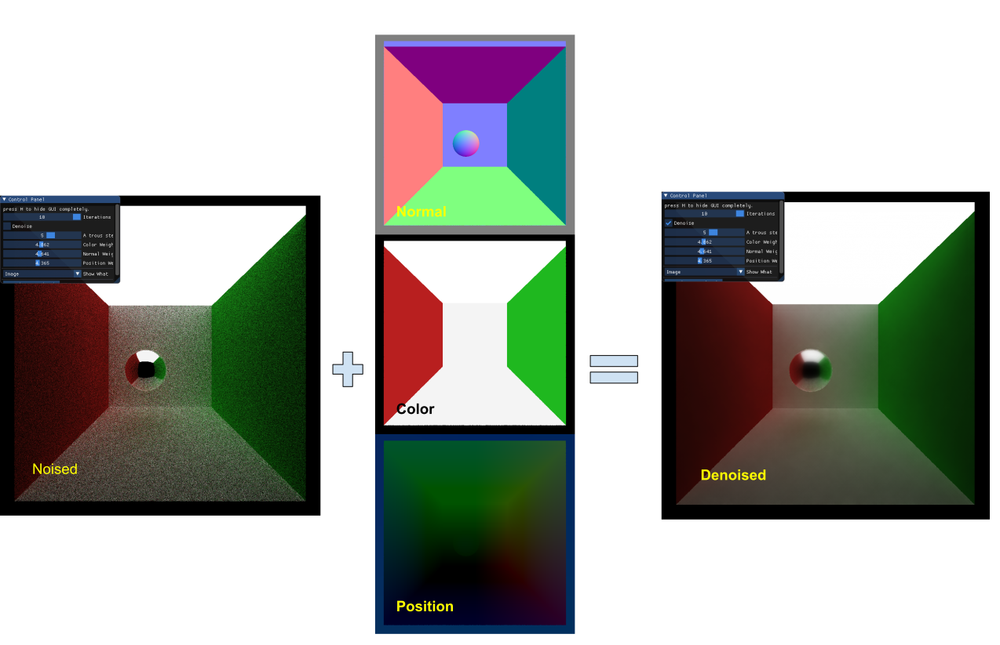

CUDA Denoiser For CUDA Path Tracer
==================================

**University of Pennsylvania, CIS 565: GPU Programming and Architecture, Project 4**

* Ling Xie
  * [LinkedIn](https://www.linkedin.com/in/ling-xie-94b939182/), 
  * [personal website](https://jack12xl.netlify.app).
* Tested on: 
  * Windows 10, Intel(R) Xeon(R) CPU E5-2650 v4 @ 2.20GHz 2.20GHz ( two processors) 
  * 64.0 GB memory
  * NVIDIA TITAN XP GP102

Thanks to [FLARE LAB](http://faculty.sist.shanghaitech.edu.cn/faculty/liuxp/flare/index.html) for this ferocious monster.

##### Cmake change

Add 

1. [PerformanceTimer.h](https://github.com/Jack12xl/Project2-Stream-Compaction/blob/master/src/csvfile.hpp) : Measure performance by system time clock. 
2. [cfg.h](https://github.com/Jack12xl/Project2-Stream-Compaction/blob/master/stream_compaction/radixSort.h),  as a configure

### Intro

Here shows the results with only 20 samples.

This repo contains  a CUDA-based path-tracer Denoiser based on [paper](https://jo.dreggn.org/home/2010_atrous.pdf)(2010) : 

**Edge-Avoiding À-Trous Wavelet Transform for fast Global Illumination Filtering.**

Basically, Denoiser serves to produce a smoother results for path-traced image even under fewer samples. Here we manage to implement the guided filtering which not only smooth the noise but also keep the edge intact.

Different from [Guided image filtering](http://kaiminghe.com/eccv10/) (ECCV2010) which only takes semantic mask or itself as guidance(only one).  this paper takes `normal, color and position` as guidance to filter the image. 

### Performance Analysis

##### **Denoising effect:**

From the image showed before, we could see that the 20 samples with denoising applied could achieve comparable results with 5000 samples.

##### Runtime:

Here shows results in different parameters:

For Cornell Box scene, I find the best match is with weight `color: 0.65`,`normal: 0.56`, `position: 0.4`

Here shows the runtime for each scene

| milliseconds | 5 steps A-trous Denoise | No denoise |
| ------------ | ----------------------- | ---------- |
| Cornell Box  | 330.6                   | 299.667    |
| Fresnel      | 1050.5                  | 954.842    |
| Teaser       | 1109.1                  | 960.42     |

Since the algorithm is **O(N)** for **N** pixel, the 

From the results and the paper we could find out that if the scenes become more complicated, the materials turn more diverse, the denoised results would go worse because the algorithm is influenced by the variance from normal, color and positions. 

### GUI modification

Aiming at better debug view, we modify the UI to support switch the frame to visualize between rendered image, normal, position and color.

#### Save by frame texture

Also for better saving, instead of saving by parsing the host image pointer, here we save the image by directly saving the frame texture depicted on screen. The method is convenient both for implementation and practical use. 

### Extra Credit:

##### Gbuffer optimization:

**oct-encoding normal** : Here we implement the normal encoding method mentioned in [paper](http://jcgt.org/published/0003/02/01/paper.pdf): A survey of Efficient Representations for Independent Unit Vectors.

It basically map 3d vectors(assume normalized) into 2d in memory by mapping the octants of a sphere to the faces of an octahedron.

Here shows the performance for oct encode in denoising

| milliseconds | no encode | oct encode |
| ------------ | --------- | ---------- |
| Cornell Box  | 330.6     | 410.8      |

The table shows that although oct encoding could save memory bandwidth for G-buffer, it could cause more overhead since every time we fetch the normal from G-buffer, we need to decode the oct representation.

**Things to mention:** The algorithm described in [paper](http://jcgt.org/published/0003/02/01/paper.pdf) might cause divided by zero. So be sure to add an small number at the denominator.

### Acknowledge

* [Edge-Avoiding A-Trous Wavelet Transform for fast Global Illumination Filtering](https://jo.dreggn.org/home/2010_atrous.pdf)
* [Spatiotemporal Variance-Guided Filtering](https://research.nvidia.com/publication/2017-07_Spatiotemporal-Variance-Guided-Filtering%3A)
* [A Survey of Efficient Representations for Independent Unit Vectors](http://jcgt.org/published/0003/02/01/paper.pdf)
* ocornut/imgui - https://github.com/ocornut/imgui
* 