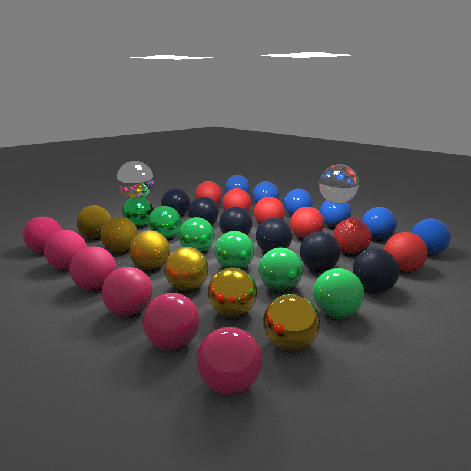
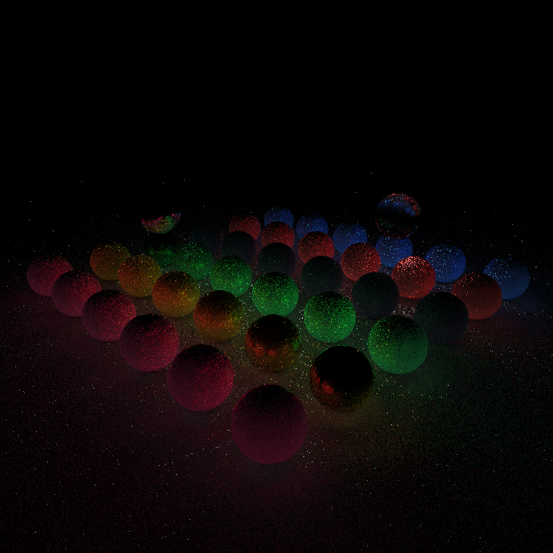
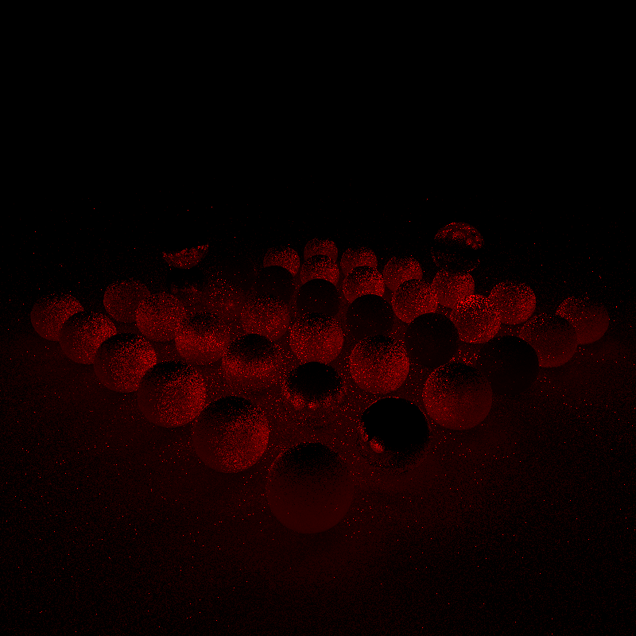
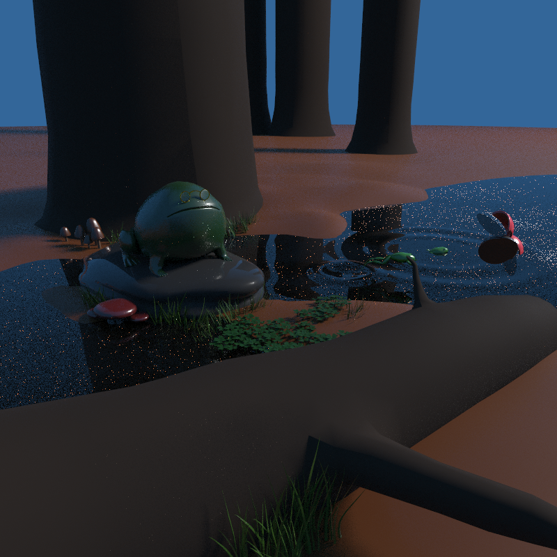
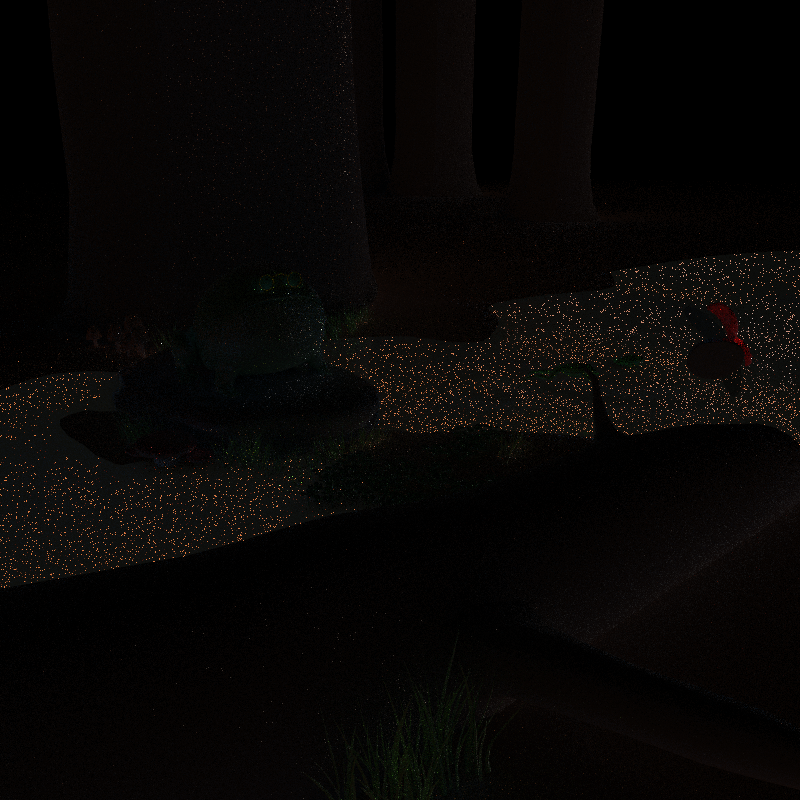
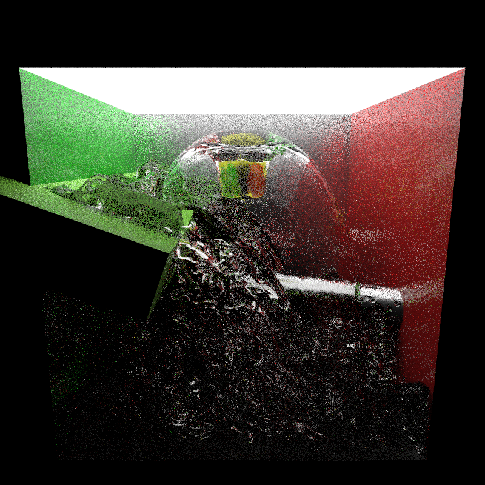
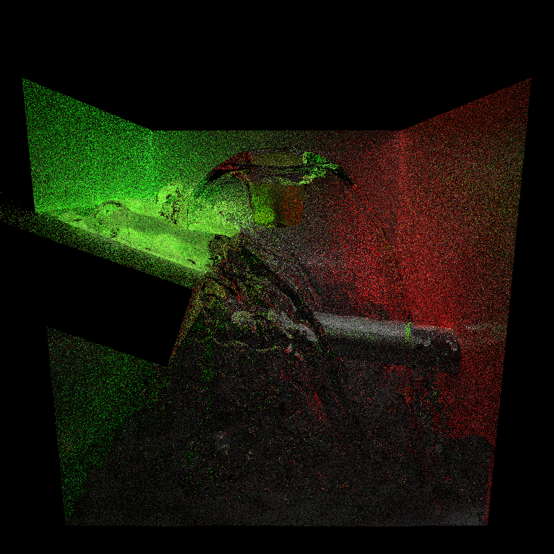
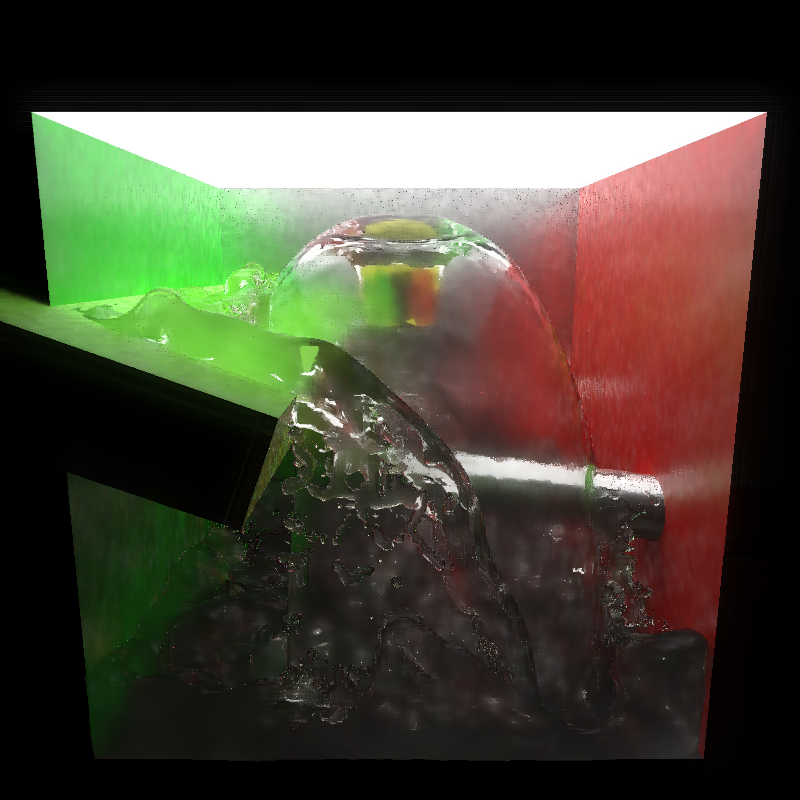

CUDA Path Tracer & Denoiser
================

**University of Pennsylvania, CIS 565: GPU Programming and Architecture, Project 3 & 4**

* Xuanyi Zhou
* Tested on: Windows 10, i7-9750H @ 2.60GHz 32GB, RTX 2060 6GB

Denoised 16 samples per pixel image.

Original 16 samples per pixel image.

## Separation of Direct and Indirect Illumination

Direct illumination, 16 samples per pixel.

Indirect illumination, 16 samples per pixel.

The path tracer has been modified to output direct and indirect illumination separately. As can be seen from the two images above, indirect illumination contains much more noise that direct illumination. Therefore, to reduce the amount of blurring, only indirect illumination is denoised.

One downside of this naive separation is that glossy and specular reflections are also considered indirect illumination. Although it's handled as a special case for specular reflection and specular transmission materials, specular reflections of objects using Disney materials are still filtered.

## Variance-Guided Filtering

Variance of direct illumination, raised to the power of 0.3.

Variance of indirect illumination, raised to the power of 0.3.

The path tracer is modified to collect variance information for both direct and indirect illumination. An example of collected variance can be seen in the images above. The majority of variance in direct illumination is caused by multiple importance sampling. While the amount of variance is roughly the same for direct and indirect illumination, it's worth noting that indirect illumination is a lot weaker than direct illumination. Therefore, indirect illumination has a much lower signal-to-noise ratio. Pixels with high variance in indirect illumination also corresponds perfectly with fireflies. This information is used to drive the color weight in A-Trous filtering in a fashion similar to that of Spatiotemporal Variance-Guided Filtering.

## Performance Analysis

- Denoising drastically lowers the amount of samples needed to achieve an acceptably smooth result, with the cost of overly-smoothed high-frequency details. This is ultimately a trade-off between computation time and loss of detail.

- Although A-Trous filtering is resolution-dependent, it is not dependent on scene geometry; that is, its execution time stays the same for arbitrarily complex scenes (with the exception of G-buffer generation). Also since it's parallelized using the GPU, its execution time is not proportional to the number of pixels.

- Denoising is the least effective with specular materials since it overly blurs the reflections. It's also not very effective to apply it to diffuse materials since they're already well sampled and does not contain much noise, but it does eliminate fireflies caused by nearby specular materials. It's most effective when used on glossy materials since it removes noise in the reflections, but does not blur it excessively as glossy reflections are blurry by themselves.

- Since the implementation uses 5 iterations of A-Trous filtering regardless of the filter size, the impact of filter size on performance is minimal. Smaller filter sizes result in less blurring, but run the risk of leaving bright spots in the result.

Filter size = 10. Note the obvious bright spots in the image.

Filter size = 20.

Filter size = 40. Note the additional blurring of the reflections on the specular golden sphere.

## Gallery

Forest scene, 16 samples per pixel.

Direct illumination in the forest scene.

Indirect illumination in the forest scene.

Forest scene, 16 samples per pixels, with aggressive denoising. Note that while the noise on the bottom of the pond is completely removed, aggressive denoising also completely filters away the reflection of sunlight onto the frog, its reflection on the stone, and the caustics around its glasses. With lighter denoising "stars" would start to appear on the bottom of the water.

-----------------------

Water scene, 16 samples per pixel.

Direct illumination in the water scene.

Indirect illumination in the water scene. A large part of the scene is lit by indirect illumination.

Denoised water scene, 16 samples per pixels. A satisfactory result is hard to obtain using such low sample count due to the complex geometry and light transport in the scene, and the wide usage of glossy materials. The direct illumination of this scene also contains a lot of noise due to the large size of the light source.

Project 3: Path Tracer
=========

Exhibition of different Disney materials with depth-of-field. The scene is composed of 29646 triangles. This image uses 4096 samples and took about 4 minutes (18 FPS) to render.

A scene I modeled for the course FNAR 567, consisting of 266988 triangles. Disney materials are used extensively in the scene. This image uses 1024 samples and took about 2 min 40 s (6 FPS) to render.

A scene produced by the fluid simulator I wrote last semester, consisting of 392080 triangles. This image uses 1024 samples and took about 6 min 40 s (2.5 FPS) to render.

# Features

## Disney BRDF

The Disney BRDF is a physically-based bidirectional reflectance distribution function with intuitive and artist-friendly parameters. This path tracer implements an isotropic version of it which includes the following attributes: base color, roughness, metallic, specular, specular tint, sheen, sheen tint, clearcoat, and clearcoat gloss. An exhibition of these materials can be seen in the image above, where each row of spheres, from bottom left to top right, exhibit varying non-metallic roughness, metallic roughness, metallic, clearcoat glossiness, sheen, and specularity.

In addition to the evaluation of this BRDF, this path tracer also implements importance sampling which greatly improves convergence speed. While it's possible to render diffuse surfaces with just uniform or cosine-weighted sampling, it's virtually impossible to obtain a converged render containing specular materials. Furthermore, while the adoption of importance sampling alters the paths taken, the sampling process itself requires little computation.

The implementation of this feature referenced [Disney's implementation in BRDF explorer](https://github.com/wdas/brdf/blob/main/src/brdfs/disney.brdf) and [Shin-Chin's blog post about implementing the BRDF in Arnold](http://shihchinw.github.io/2015/07/implementing-disney-principled-brdf-in-arnold.html). This implementation corrects a mistake in Shin-Chin's implementation of importance sampling of the clearcoat lobe. The Disney implementation multiplies the clearcoat lobe weight by 1/4, but this would usually make the clearcoat reflections too dark. This implementation mirrors Shin-Chin's implementation and omits the coefficient.

This feature does not benefit from being implemented on the GPU besides the parallelism. The importance sampling process includes a three-way branch, but it's unclear whether it can be eliminated. Moreover, the sampling strategy does not take into accouint the validity of outgoing rays, and it can be modified to generate higher-quality samples.

## Multiple Importance Sampling

A render of the Disney scene with 256 samples, rendered with MIS.

A render of the Disney scene with 256 samples, rendered with only importance sampling.

Multiple importance sampling (MIS) is a commonly-used variance reduction technique. For each bounce, two additional samples, one for a randomly-chosen light and one according to the BSDF, are taken, and their contribution are weighted according to their PDF values.

Very different noise characteristics can be observed in the two images above. Multiple importance sampling greatly reduces variance on the floor and on most spheres. However, it also introduces fireflies in the render near specular surfaces.

Since multiple importance sampling takes two additional samples per intersection and performs intersection tests, it's understandably slower than naive sampling. For example, 1000 samples of the Disney scene took 79.877 seconds with MIS, but only 53.493 seconds without MIS.

This feature does not benefit from being implemented on the GPU besides the parallelism. In fact, since this is a relatively costly operation that is executed conditionally based on the type of material, it could lead to warp divergence. Sorting the path segments by material ID is a potential way to accelerate this. Unfortunately in practice the cost of sorting outweighs the benefit it brings.

## Bounding Volume Hierarchy

The path tracer implements bounding volume hierarchies in the form of AABB trees. The tree is constructed using the method described by the PBR book and references [my previous implementation](https://github.com/lukedan/libfluid/blob/master/include/fluid/renderer/aabb_tree.h). The tree is traversed iteratively using a stack. Without a bounding volume hierarchy, it would be virtually impossible to render scenes with hundreds of thousands of triangles.

This feature does not benefit from being implemented on the GPU besides the parallelism. As an optimization, instead of performing performing geometry intersection tests immediately when reaching a leaf node, the geometry indices are added to an array and are tested at regular intervals, which in theory should reduce warp divergence. However, testing different array sizes revealed very little differences in execution times.

## Stratified Sampling

Stratified sampling is used to speed up convergence. In order for this method to be feasible on the GPU, instead of generating samples individually for each pixel, a series of sample pools are generated by generating and shuffling arrays of stratified grid indices. One pool is generated for each of the three samples of each iteration, and threads simply go through these samples. Samples for subpixel positions, depth of field, and light sampling are generated similarly.

This feature does not benefit from being implemented on the GPU besides the parallelism. Thanks to the usage of unified sample pools, its performance impact is minimal.
